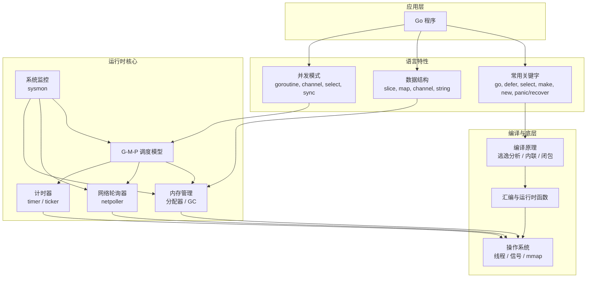
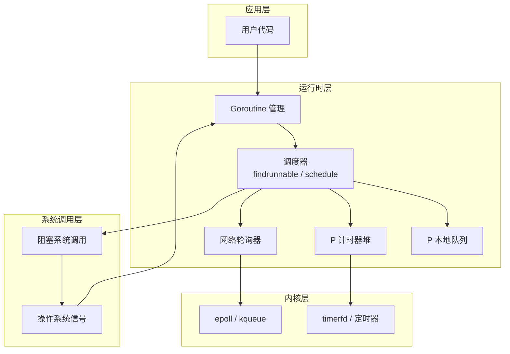

# Go 语言整体架构：以 G-M-P 为核心的运行时与语言生态

Go 语言的运行时（runtime）和编译器的设计围绕 **G-M-P 调度模型** 展开，并向上支撑并发编程、内存管理、数据结构、常用关键字等语言特性。下面从底层到应用层，梳理 Go 的整体脉络与架构。

## 1. 分层架构总览

下图展示了 Go 语言的核心组件关系：

## 2. G-M-P 调度模型（核心枢纽）

Go 调度器由四个核心实体组成：**G（协程）**、**P（处理器）**、**M（操作系统线程）** 以及 **Scheduler（调度器）**。它们共同实现了高效的并发执行。

### 2.1 协程（G - Goroutine）
- **定义**：用户态轻量级线程，执行用户代码。
- **栈管理**：初始栈仅 2KB，可动态扩容至 1GB（连续栈）。
- **状态**：`_Gidle`、`_Grunnable`、`_Grunning`、`_Gwaiting`、`_Gsyscall`、`_Gdead` 等。
- **创建**：通过 `go func()` 创建，由编译器转换为 `newproc` 调用。

### 2.2 处理器（P - Processor）
- **定义**：逻辑处理器，数量由 `GOMAXPROCS` 决定（默认等于 CPU 核数）。
- **职责**：
  - 持有本地运行队列（`runq`，容量 256）。
  - 管理计时器堆（`timers`），用于延迟任务。
  - 持有内存分配器的本地缓存（`mcache`）。
- **状态**：`_Pidle`、`_Prunning`、`_Psyscall`、`_Pgcstop`、`_Pdead`。

### 2.3 操作系统线程（M - Machine）
- **定义**：真正的系统线程，由操作系统调度。
- **职责**：执行 G 的代码，必须绑定一个 P 才能运行。
- **特殊 M**：`sysmon` 线程独立于 G-M-P，不绑定 P，用于系统监控。

### 2.4 调度器（Scheduler）
- **核心函数**：`schedule()`、`findrunnable()`、`gopark()`、`goready()`。
- **调度策略**：
  - **工作窃取（work-stealing）**：当 P 的本地队列为空时，从其他 P 或全局队列窃取一半 G。
  - **阻塞处理**：
    - 通道、锁、系统调用等阻塞时，G 调用 `gopark` 进入等待状态，M 继续执行其他 G。
    - 阻塞系统调用会让 M 释放 P，P 可绑定其他 M。
  - **抢占**：
    - 协作抢占：函数调用、通道操作等安全点。
    - 异步抢占（Go 1.14+）：`sysmon` 检测到长时间运行的 G（>10ms），发送 SIGURG 信号强制暂停。
- **与 netpoller 协作**：空闲时调用 `netpoll(true, timeout)` 阻塞，等待网络事件或计时器。

### 2.5 关联组件协作

#### 调度器与 netpoller 的协作
- 调度器在 `findrunnable` 中无任务时，会调用 `netpoll(true, timeout)`，其中 `timeout` 取当前 P 的计时器堆顶剩余时间。
- 这实现了 **一次系统调用同时等待网络事件和计时器**，避免了轮询。

#### 计时器的精准触发
- 每个 P 维护一个最小四叉堆，堆顶为最近到期计时器。
- 调度器阻塞时使用该到期时间作为 `epoll_wait` 的超时参数。
- 到期后，`epoll_wait` 返回，调度器检查并执行计时器回调。

#### sysmon 的兜底角色
- **抢占**：检测到 G 运行超过 10ms 且无抢占点 → 发送 SIGURG 信号强制抢占。
- **系统调用解绑**：P 处于 `_Psyscall` 超过 10ms → 解绑 P，让其他 M 使用。
- **网络事件**：距离上次 `netpoll` 超过 10ms → 主动调用 `netpoll(false)` 获取就绪 G。
- **计时器**：如果某个 P 的堆顶计时器已到期但该 P 未被调度，sysmon 会直接触发该计时器。

### 2.6 组件依赖关系

| 组件 | 依赖/关联 | 说明 |
|------|-----------|------|
| **Scheduler** | P, G, M, Netpoller, Timer | 调度器直接管理 P 的运行队列和计时器堆，调用 netpoll 获取就绪 G。 |
| **P** | G, Timer, M | P 持有本地 G 队列和计时器堆，必须绑定 M 才能执行。 |
| **M** | P | M 必须关联一个 P 才能运行 G。 |
| **G** | P, M | G 被调度到 P 的队列中，最终在 M 上执行。 |
| **Netpoller** | OS, Scheduler | netpoll 依赖操作系统事件机制，调度器通过它获取就绪网络 G。 |
| **Timer** | P, Scheduler, sysmon | Timer 存储在 P 的堆中，调度器在阻塞等待时使用其到期时间作为 netpoll 超时，sysmon 兜底触发。 |
| **sysmon** | P, Netpoller, Scheduler | sysmon 独立运行，定期扫描并干预异常情况。 |

### 2.7 架构分层视图

> 更多详细的组件交互流程（如网络阻塞唤醒、计时器与调度器协作、sysmon 抢占等）可参考《Go 语言设计与实现》中的相关章节。

## 3. 内存管理：分配器与垃圾回收

### 3.1 内存分配器（基于 TCMalloc）
- **三级缓存**：`mcache`（P 私有） → `mcentral`（中心缓存） → `mheap`（堆）。
- **对象分类**：
  - 微对象 (<16B)：通过 `mcache.tiny` 分配，合并以减少碎片。
  - 小对象 (16B~32KB)：按 67 种 size class 分配，`mcache` 无锁。
  - 大对象 (>32KB)：直接从 `mheap` 分配。
- **栈内存**：特殊分配器（`stackcache` / `stackpool` / `stackLarge`），每个 G 拥有独立连续栈，动态扩容/收缩。

### 3.2 垃圾回收（并发三色标记 + 混合写屏障）
- **触发条件**：堆大小达到 `GOGC` 阈值（默认 100%）、超过 2 分钟无 GC、手动调用。
- **标记阶段**：并发进行，写屏障保证三色不变性。
- **混合写屏障 + 新对象黑化 → 消除栈重扫描**：
  - 传统并发标记需要在标记终止时重新扫描所有 goroutine 的栈，以保证栈上指针的准确性，这会导致 STW 时间与 goroutine 数量成正比。
  - Go 1.8 引入**混合写屏障**，其规则为：
    - 将被覆盖的旧指针指向的对象标记为灰色（删除屏障）。
    - 如果当前 goroutine 的栈尚未扫描（仍为灰色），则还将新指针指向的对象标记为灰色。
  - 同时，在 GC 标记阶段**所有新创建的对象直接被标记为黑色**。
  - 结合这两点，可以证明：在标记终止时，所有栈上的对象已经是黑色，且栈上指针不会指向白色对象，因此**无需重新扫描栈**。这大大缩短了 STW 时间（通常 < 100µs）。
- **清扫阶段**：惰性并发清扫，两种回收器（对象回收器、span 回收器）。
- **标记辅助 (Mark Assist)**：用户协程分配内存时若标记进度落后，主动参与标记，平衡分配与回收速率。

## 4. 数据结构与常用关键字

| 组件 | 底层实现 | 关联运行时 |
|------|----------|------------|
| **slice** | `reflect.SliceHeader`（ptr, len, cap） | 内存分配器 |
| **map** | `hmap` + `bmap`，桶数组 + 溢出链 | 内存分配器，扩容时渐进式搬迁 |
| **channel** | `hchan`（环形队列 + 等待队列） | G-M-P（`gopark` / `goready`） |
| **string** | `reflect.StringHeader`（ptr, len），只读 | 内存分配器（只读数据段或堆） |
| **defer** | `_defer` 链表，LIFO 执行 | 调度器（函数返回前调用） |
| **select** | `selectgo` 函数，随机化 case | 调度器（阻塞时挂起 G） |
| **panic/recover** | `_panic` 链表，`defer` 中 recover | 调度器（栈展开） |
| **make / new** | 编译期转换，`make` 用于 slice/map/chan | 内存分配器 |

## 5. 编译原理：逃逸分析与闭包

- **逃逸分析**：遵循两条不变性（栈指针不入堆，栈指针生命周期不超栈帧）。编译器决定变量在栈还是堆上分配。
- **闭包**：编译为结构体（函数指针 + 捕获的变量），捕获的变量如果取地址或发生逃逸，则分配在堆上。
- **内联优化**：小函数内联，减少调用开销。
- **基于寄存器的调用约定**（Go 1.17+）：参数优先用寄存器传递，减少栈操作。

## 6. 并发编程最佳实践

- **优先使用 channel 传递数据所有权**，避免共享内存。
- **使用 `sync.Mutex` / `RWMutex` 保护临界区**，注意不可重入。
- **`sync.WaitGroup` 等待 goroutine 完成**，避免泄漏。
- **`sync.Pool` 复用临时对象**，减少 GC 压力。
- **`context` 传递取消信号和截止时间**，管理 goroutine 生命周期。
- **控制并发数**：带缓冲 channel 或 `semaphore.Weighted`。

## 7. 运行时监控与调优

- **`GOMAXPROCS`**：控制 P 的数量，默认等于 CPU 核数。
- **`GOGC`**：调整 GC 触发阈值，内存-时间权衡。
- **`pprof`**：分析 CPU、内存、goroutine、锁竞争。
- **`trace`**：查看调度器行为、GC 事件、网络轮询。
- **`GODEBUG`**：环境变量，如 `schedtrace=1000` 打印调度器信息。

## 8. 总结

Go 运行时以 **G-M-P 调度模型** 为核心，向上支撑并发原语（goroutine、channel、select），向下整合内存管理（分配器 + GC）、网络轮询器、计时器、系统监控等组件。调度器采用事件驱动设计，空闲时通过 netpoller 阻塞等待网络事件或计时器到期，**不主动轮询**；netpoller 封装操作系统事件机制，与计时器超时统一；sysmon 作为主动轮询的监控线程，处理调度器无法覆盖的边缘情况（死循环、长时间系统调用、计时器遗漏等），保证系统健壮性。编译器的逃逸分析、内联优化、调用约定等与运行时紧密配合，共同实现了 Go 的高并发、高性能和内存安全。理解这一整体架构，有助于开发者写出更高效、更健壮的 Go 程序。

> 注：本文档基于 Go 1.18~1.22 源码及官方设计，具体细节可参考 `runtime`、`sync`、`reflect` 等标准库源码。