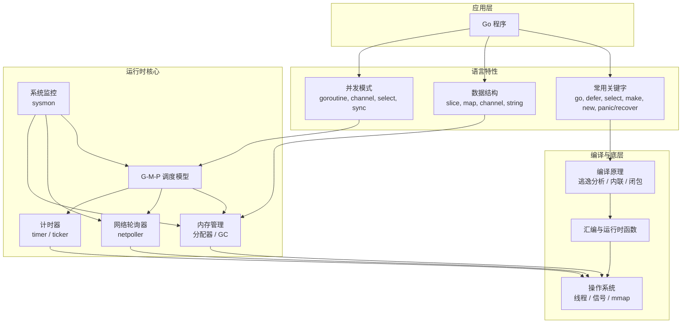

# Go 语言整体架构：以 G-M-P 为核心的运行时与语言生态

Go 语言的运行时（runtime）和编译器的设计围绕 **G-M-P 调度模型** 展开，并向上支撑并发编程、内存管理、数据结构、常用关键字等语言特性。下面从底层到应用层，梳理 Go 的整体脉络与架构。

## 1. 分层架构总览

下图展示了 Go 语言的核心组件关系：

## 2. G-M-P 调度模型（核心枢纽）

**G (Goroutine)**：用户态轻量级协程，初始栈 2KB，动态扩容。  
**M (Machine)**：操作系统线程，执行 G 的代码。  
**P (Processor)**：逻辑处理器，数量 = `GOMAXPROCS`，持有本地运行队列和计时器堆。

**调度机制**：
- 每个 P 负责调度 G 到 M 上执行，M 必须绑定一个 P 才能运行。
- 调度器采用 **工作窃取 (work-stealing)** 平衡负载：当 P 的本地队列空时，从其他 P 偷取一半 G。
- 阻塞系统调用时，M 释放 P，P 可绑定其他 M；非阻塞网络 I/O 通过 netpoller 实现用户态阻塞。

**关联组件**：
- **netpoller**：网络事件驱动，调度器空闲时阻塞在 `epoll_wait`，事件就绪时唤醒对应的 G。
- **timer**：每个 P 的堆顶计时器，调度器阻塞时将其剩余时间作为 netpoller 超时，实现统一等待。
- **sysmon**：独立监控线程，周期性扫描，处理长时间运行的 G（抢占）、系统调用阻塞的 P、强制触发 GC 等。

## 3. 内存管理：分配器与垃圾回收

### 3.1 内存分配器（基于 TCMalloc）
- **三级缓存**：`mcache`（P 私有） → `mcentral`（中心缓存） → `mheap`（堆）。
- **对象分类**：
  - 微对象 (<16B)：通过 `mcache.tiny` 分配，合并以减少碎片。
  - 小对象 (16B~32KB)：按 67 种 size class 分配，`mcache` 无锁。
  - 大对象 (>32KB)：直接从 `mheap` 分配。
- **栈内存**：特殊分配器（`stackcache` / `stackpool` / `stackLarge`），每个 G 拥有独立连续栈，动态扩容/收缩。

### 3.2 垃圾回收（并发三色标记 + 混合写屏障）
- **触发条件**：堆大小达到 `GOGC` 阈值（默认 100%）、超过 2 分钟无 GC、手动调用。
- **标记阶段**：并发进行，写屏障保证三色不变性，**混合写屏障**消除了栈重扫描，STW 时间 < 500µs。
- **清扫阶段**：惰性并发清扫，两种回收器（对象回收器、span 回收器）。
- **标记辅助 (Mark Assist)**：用户协程分配内存时若标记进度落后，主动参与标记，平衡分配与回收速率。

## 4. 数据结构与常用关键字

| 组件 | 底层实现 | 关联运行时 |
|------|----------|------------|
| **slice** | `reflect.SliceHeader`（ptr, len, cap） | 内存分配器 |
| **map** | `hmap` + `bmap`，桶数组 + 溢出链 | 内存分配器，扩容时渐进式搬迁 |
| **channel** | `hchan`（环形队列 + 等待队列） | G-M-P（`gopark` / `goready`） |
| **string** | `reflect.StringHeader`（ptr, len），只读 | 内存分配器（只读数据段或堆） |
| **defer** | `_defer` 链表，LIFO 执行 | 调度器（函数返回前调用） |
| **select** | `selectgo` 函数，随机化 case | 调度器（阻塞时挂起 G） |
| **panic/recover** | `_panic` 链表，`defer` 中 recover | 调度器（栈展开） |
| **make / new** | 编译期转换，`make` 用于 slice/map/chan | 内存分配器 |

## 5. 编译原理：逃逸分析与闭包

- **逃逸分析**：遵循两条不变性（栈指针不入堆，栈指针生命周期不超栈帧）。编译器决定变量在栈还是堆上分配。
- **闭包**：编译为结构体（函数指针 + 捕获的变量），捕获的变量如果取地址或发生逃逸，则分配在堆上。
- **内联优化**：小函数内联，减少调用开销。
- **基于寄存器的调用约定**（Go 1.17+）：参数优先用寄存器传递，减少栈操作。

## 6. 并发编程最佳实践

- **优先使用 channel 传递数据所有权**，避免共享内存。
- **使用 `sync.Mutex` / `RWMutex` 保护临界区**，注意不可重入。
- **`sync.WaitGroup` 等待 goroutine 完成**，避免泄漏。
- **`sync.Pool` 复用临时对象**，减少 GC 压力。
- **`context` 传递取消信号和截止时间**，管理 goroutine 生命周期。
- **控制并发数**：带缓冲 channel 或 `semaphore.Weighted`。

## 7. 运行时监控与调优

- **`GOMAXPROCS`**：控制 P 的数量，默认等于 CPU 核数。
- **`GOGC`**：调整 GC 触发阈值，内存-时间权衡。
- **`pprof`**：分析 CPU、内存、goroutine、锁竞争。
- **`trace`**：查看调度器行为、GC 事件、网络轮询。
- **`GODEBUG`**：环境变量，如 `schedtrace=1000` 打印调度器信息。

## 8. 总结

Go 运行时以 **G-M-P 调度模型** 为核心，向上支撑并发原语（goroutine、channel、select），向下整合内存管理（分配器 + GC）、网络轮询器、计时器、系统监控等组件。编译器的逃逸分析、内联优化、调用约定等与运行时紧密配合，共同实现了 Go 的高并发、高性能和内存安全。理解这一整体架构，有助于开发者写出更高效、更健壮的 Go 程序。

> 注：本文档基于 Go 1.18~1.22 源码及官方设计，具体细节可参考 `runtime`、`sync`、`reflect` 等标准库源码。