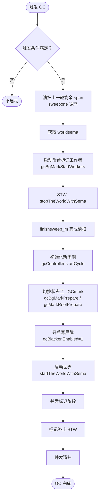

# Go 语言垃圾收集器（GC）实现原理、版本演进与使用指南

## 0. 为什么需要垃圾收集器？它主要解决什么问题？

Go 语言中的垃圾收集器（Garbage Collector，GC）是运行时自动管理堆内存的关键组件，主要解决以下问题：

1. **避免手动内存管理错误**：自动回收不再使用的内存，消除程序员忘记释放内存（内存泄漏）或提前释放（悬空指针）的风险。
2. **提高开发效率**：让开发者专注于业务逻辑，无需关心内存分配与释放的配对。
3. **保证内存安全**：GC 在回收内存前会确保对象不再被引用，避免了 C/C++ 中常见的 use-after-free 漏洞。
4. **支持高并发**：Go 的 GC 设计为并发执行（与用户 goroutine 同时运行），减少 Stop-The-World（STW）时间，从而降低对延迟敏感型应用的影响。

## 1. 新老版本设计区别

| 版本 | 关键变化 | 说明 |
|------|----------|------|
| **Go 1.0 - 1.2** | 简单的标记-清扫（Mark-Sweep），STW 时间较长 | 整个 GC 过程需要暂停所有用户 goroutine。 |
| **Go 1.3** | 改进标记-清扫，增加写屏障 | 初步支持并发标记，但清扫阶段仍需要 STW。 |
| **Go 1.4** | 引入三色标记法（Tri-color Marking） | 为并发标记奠定基础。 |
| **Go 1.5** | **并发 GC（Concurrent GC）** | 标记和清扫阶段大部分并发执行，STW 时间大幅降低（通常在毫秒级）。 |
| **Go 1.6** | 减少 GC 停顿 | 进一步优化并发标记，减少 STW。 |
| **Go 1.7** | 增加 `runtime.GC` 可主动触发 GC | 提供更多控制。 |
| **Go 1.8** | **混合写屏障（Hybrid Write Barrier）** | 取代原有的 Dijkstra 写屏障，显著缩短 STW 时间（通常 < 100µs）。 |
| **Go 1.10** | 增加 `debug.SetGCPercent` | 允许动态调整 GC 频率。 |
| **Go 1.12** | 优化 `sync.Pool` 与 GC 的交互 | 减少 GC 时对 `sync.Pool` 的清空。 |
| **Go 1.14** | 引入**抢占式 GC** | GC 可以在更多时机安全地暂停 goroutine。 |
| **Go 1.18+** | 泛型支持，GC 无直接影响 | 性能持续优化。 |

> 核心演进：从 **STW 标记-清扫** → **并发三色标记** → **混合写屏障**，Go 的 GC 停顿时间从秒级降至微秒级。

## 2. GC 触发条件与全局变量

### 2.1 触发条件

Go 垃圾收集器的触发由 `gcTrigger` 结构决定，共有三种触发条件：

| 触发类型 | 说明 | 触发源 |
|----------|------|--------|
| **`gcTriggerHeap`** | 堆内存分配达到控制器计算的触发堆大小（默认上次 GC 后存活堆的 2 倍）。 | `runtime.mallocgc`（每次内存分配时检查） |
| **`gcTriggerTime`** | 如果距离上一次 GC 超过 2 分钟，强制触发。由 `runtime.forcegcperiod` 控制（默认 2 分钟）。 | `runtime.sysmon` 和 `runtime.forcegchelper` 后台协程 |
| **`gcTriggerCycle`** | 手动调用 `runtime.GC()` 或某些内部条件（如 `debug.SetGCPercent` 后）。 | 用户代码或运行时内部调用 |

### 2.2 相关全局变量

Go GC 涉及以下重要的全局变量：

- `work`：`gcWork` 类型，存储灰色工作队列、标记状态等。
- `gcController`：控制 GC 触发阈值、标记辅助比率等。
- `worldsema`：用于 STW 的信号量。
- `sweep`：清扫阶段的统计数据。
- `forcegc`：强制 GC 的后台协程状态。

这些变量在 `runtime/mgc.go` 中定义。

## 3. GC 启动流程（`gcStart`）详解

GC 启动时调用 `runtime.gcStart(trigger gcTrigger)`，其详细步骤可归纳为以下几个阶段：

### 3.1 预检查与清扫收尾

```go
func gcStart(trigger gcTrigger) {
    // 循环检查触发条件，并完成上一轮未完成的清扫
    for trigger.test() && sweepone() != ^uintptr(0) {
        sweep.nbgsweep++
    }
    semacquire(&work.startSema)
    if !trigger.test() {
        semrelease(&work.startSema)
        return
    }
    // ...
}
```

- 调用 `trigger.test()` 验证是否满足 GC 条件。
- 调用 `sweepone()` 清理一个内存管理单元，直到所有单元都被清理（确保上一轮 GC 彻底结束）。

### 3.2 准备阶段（STW）

```go
    semacquire(&worldsema)
    gcBgMarkStartWorkers()               // 启动后台标记工作者
    work.stwprocs, work.maxprocs = gomaxprocs, gomaxprocs
    systemstack(stopTheWorldWithSema)    // STW
    systemstack(func() {
        finishsweep_m()                  // 最终完成清扫
    })
    work.cycles++
    gcController.startCycle()            // 开始新的 GC 周期
```

- 获取 `worldsema` 信号量，防止并发 GC。
- 启动后台标记工作者（`gcBgMarkStartWorkers`）。
- **STW**：停止所有用户 goroutine，调用 `finishsweep_m` 确保所有内存单元都已清理。
- 更新 GC 周期计数，初始化 `gcController`。

### 3.3 标记准备与并发标记开始

```go
    // 切换到标记状态
    setGCPhase(_GCmark)
    gcBgMarkPrepare()                    // 初始化后台标记队列
    gcMarkRootPrepare()                  // 准备根对象（栈、全局变量等）
    gcBlackenEnabled = 1                 // 启用涂黑操作
    startTheWorldWithSema()              // 恢复用户程序
    // 并发标记阶段开始...
}
```

- 设置全局 GC 状态为 `_GCmark`。
- 调用 `gcBgMarkPrepare` 初始化后台标记工作队列。
- 调用 `gcMarkRootPrepare` 扫描根对象（goroutine 栈、全局变量等）并放入灰色队列。
- 设置 `gcBlackenEnabled = 1`，允许写屏障将对象涂黑。
- 恢复用户程序，**并发标记**正式开始。

### 3.4 流程图整合

下图将 `gcStart` 的详细步骤整合进 GC 整体流程中：



## 4. 标记辅助（Mark Assist）详解

**问题**：为什么需要标记辅助？它是如何工作的？

### 4.1 背景

在并发标记阶段，用户程序（Mutator）仍在不断分配新对象。如果分配速度过快，堆内存可能快速增长，导致 GC 标记的速度跟不上，最终可能使堆在标记完成前就达到触发阈值，造成“GC 风暴”或内存耗尽。

### 4.2 核心思想

**“分配多少内存，就必须完成等量的标记工作”**。Go 通过一个“信用账户”体系来平衡分配和标记：

- 每个 P（处理器）持有 `gcAssistBytes` 字段，代表该 P 上尚未完成的标记“债务”。
- 当用户 goroutine 分配内存时（如 `new`、`make`），除了从堆上分配内存，还会扣除相应大小的 `gcAssistBytes` 信用。如果信用不足（变为负数），该 goroutine 必须执行**辅助标记（Mark Assist）** 来“偿还”债务。
- 辅助标记的具体工作：从灰色队列中取出对象，标记为黑色，并扫描其引用，将新引用的对象加入灰色队列。每完成一定量的标记工作（例如标记 64KB 的对象），就增加相应的信用额度。

### 4.3 账户平衡机制

- 后台标记工作者（`gcBgMarkWorker`）会持续完成标记任务，并产生“信用”，补充到 `gcController` 的全局池中。
- 每个 P 在分配内存时，会从全局池中申请信用，存入自己的 `gcAssistBytes`。
- 当全局池信用充足时，用户 goroutine 几乎不需要辅助标记；当全局池耗尽，用户分配就会触发辅助标记。
- 最终，整个系统的标记速率和分配速率达到动态平衡，确保标记能在预期的堆大小（由 `GOGC` 控制）之前完成。

### 4.4 示例

假设 `GOGC=100`，当前存活堆为 10 MB，触发阈值为 20 MB。若用户程序分配速度极快，标记速度跟不上，堆可能很快逼近 20 MB。这时，分配内存的 goroutine 会被强制进行辅助标记，减慢分配速度，同时加速标记，防止堆超限。

## 5. GC 清理阶段：两种回收器

标记完成后，进入并发清扫阶段。Go 使用两种回收器来释放内存：

### 5.1 对象回收器（Object Reclaimer）

- **触发时机**：在 `runtime.mcentral.cacheSpan`（从中心缓存获取新 span 时）或 `runtime.sweepone`（惰性清扫）中调用。
- **工作方式**：扫描一个 `mspan`，检查其 `allocBits` 位图，找出未被标记的对象（白色），并将其槽位标记为空闲。如果该 `mspan` 中所有对象都未被标记（即整个 span 都是垃圾），则将该 `mspan` 直接归还给 `mheap`，而不是逐个释放对象。
- **特点**：惰性执行，只在需要新内存时触发，避免一次性停顿。

### 5.2 内存单元回收器（Span Reclaimer）

- **触发时机**：由 `runtime.mheap.reclaim` 触发，通常是在系统监控（`sysmon`）或 GC 结束时主动回收。
- **工作方式**：扫描整个堆的 `heapArena`，查找完全未被标记的 `mspan`（即其中所有对象都是白色）。将这些 `mspan` 直接释放给操作系统或放入 `mheap` 的空闲列表。
- **特点**：批量回收大块内存，减少碎片，提高内存利用率。

两种回收器协同工作，对象回收器负责细粒度的内存释放，内存单元回收器负责粗粒度的内存收缩。

## 6. 常见问题解答

### 问题1：Go 语言中常见的栈和堆比例是多少？能否像 JVM 那样配置？

- **栈与堆没有固定比例**：每个 Goroutine 的初始栈为 2KB，可动态增长至最大 1GB。栈上分配的是局部变量、函数参数等，堆上分配的是逃逸的对象、全局变量等。两者的比例完全取决于程序的逃逸分析结果和内存分配模式。
- **配置方式**：Go 没有像 JVM 那样直接配置栈大小（`-Xss`）或堆比例（`-Xmx`）。但可以通过以下方式间接控制：
  - 调整 `GOGC` 环境变量（默认 100）来改变堆增长阈值，从而影响 GC 频率和堆内存占用。
  - 使用 `debug.SetMaxStack` 限制单个 Goroutine 的最大栈大小。
  - 通过 `runtime.GOMAXPROCS` 控制并发度，间接影响内存使用。
  - 无法直接限制堆内存上限，但可以通过 `runtime/debug.SetMemoryLimit`（Go 1.19+）设置软内存限制。

### 问题2：GC 标记期间如何保证所有可达对象都被标记？

详细回答见上文“混合写屏障”部分。简而言之：通过根扫描 + 混合写屏障 + 新对象黑化，保证了三色不变性，确保所有可达对象都被正确标记。

### 问题3：GOGC=100 会不会导致 GC 时间越来越长？

不会无限增长。GC 时间主要与存活堆大小（工作集）成正比。当工作集稳定后，每次 GC 的堆大小也会稳定在 (1+GOGC/100)*存活堆 附近，因此 GC 时间会趋于稳定。但如果工作集持续增长（如缓存不断增加），GC 时间也会随之增长。

## 7. 最佳实践与注意事项

- **调整 GOGC**：根据应用的内存敏感性和吞吐量要求，适当增大或减小 `GOGC`。
- **使用 `sync.Pool`**：复用临时对象，减少分配压力。
- **避免不必要的指针**：减少 GC 扫描成本。
- **监控 GC 统计**：利用 `runtime.ReadMemStats` 或 `pprof` 观察 GC 频率和停顿时间。
- **注意栈与堆的平衡**：尽量让对象在栈上分配，通过逃逸分析优化。

## 8. 总结

Go 的垃圾收集器通过并发三色标记、混合写屏障、标记辅助和惰性清扫等机制，实现了极低的 STW 停顿（通常 < 500µs）和高效的内存回收。GC 的触发由堆增长、时间和手动调用三种条件驱动。理解 GC 的内部流程（`gcStart`、标记辅助、两种回收器）有助于开发者编写高性能、低延迟的 Go 程序。

## 9. GC架构图
以下是一个 Go 垃圾收集器（GC）的架构图，使用 Mermaid 绘制，涵盖了 GC 的触发源、核心阶段、关键组件及其交互关系。你可以将此代码块放入 `.md` 文件中。

```mermaid
graph TD
    subgraph GC触发源
        A1[runtime.mallocgc<br>堆内存分配]
        A2[runtime.sysmon<br>系统监控]
        A3[runtime.forcegchelper<br>后台强制GC协程]
        A4[用户调用 runtime.GC]
    end

    subgraph GC启动与调度
        B1[gcTrigger.test<br>检查触发条件]
        B2[gcStart]
        B3[后台标记工作者<br>gcBgMarkWorkers]
    end

    subgraph STW阶段
        C1[停止世界<br>stopTheWorldWithSema]
        C2[清扫终止<br>finishsweep_m]
        C3[标记准备<br>gcMarkRootPrepare]
        C4[标记终止<br>gcMarkTermination]
    end

    subgraph 并发标记阶段
        D1[写屏障<br>hybrid write barrier]
        D2[根对象扫描<br>goroutine栈、全局变量]
        D3[灰色工作队列<br>gcWork]
        D4[后台标记工作者<br>扫描灰色对象]
        D5[标记辅助<br>Mark Assist]
        D6[新对象直接标记为黑色]
    end

    subgraph 并发清扫阶段
        E1[对象回收器<br>sweepone / mcentral.cacheSpan]
        E2[内存单元回收器<br>mheap.reclaim]
        E3[归还内存至<br>mcentral / mheap]
    end

    subgraph 结束与统计
        F1[更新 GC 控制器<br>gcController]
        F2[记录统计信息<br>memstats]
    end

    A1 --> B1
    A2 --> B1
    A3 --> B1
    A4 --> B1
    B1 -->|满足条件| B2
    B2 --> B3
    B2 --> C1
    C1 --> C2
    C2 --> C3
    C3 --> D2
    C1 --> C4   // 标记终止阶段另有STW

    D2 --> D3
    D3 --> D4
    D4 --> D3
    D5 --> D4
    D1 --> D3

    D4 -->|标记完成| C4
    C4 --> E1
    E1 --> E3
    E2 --> E3
    E3 --> F1
    F1 --> F2

    // 关系标注
    D1 -->|并发执行| A1
    D5 -->|分配内存时触发| A1
    E1 -->|惰性清扫| A1
    E2 -->|后台触发| A2

    classDef trigger fill:#f9f,stroke:#333,stroke-width:2px;
    classDef stw fill:#f99,stroke:#333;
    classDef concurrent fill:#9f9,stroke:#333;
    classDef cleanup fill:#9cf,stroke:#333;
    class A1,A2,A3,A4 trigger;
    class C1,C2,C3,C4 stw;
    class D1,D2,D3,D4,D5,D6 concurrent;
    class E1,E2,E3 cleanup;
```

### 架构图说明

1. **GC 触发源**  
   - `mallocgc`：每次堆内存分配都可能触发（当堆大小超过 GOGC 阈值）。  
   - `sysmon`：系统监控线程，若超过 2 分钟无 GC，强制触发。  
   - `forcegchelper`：专门的后台协程，定期检查强制触发条件。  
   - 用户主动调用 `runtime.GC()`。

2. **GC 启动与调度**  
   - `gcTrigger.test` 统一检查触发条件。  
   - `gcStart` 初始化 GC 周期，启动后台标记工作者（`gcBgMarkWorkers`）。

3. **STW 阶段**（红色节点）  
   - **清扫终止**：完成上一轮未清扫的 span。  
   - **标记准备**：扫描根对象（栈、全局变量）并放入灰色队列。  
   - **标记终止**：关闭写屏障，完成最终标记。  
   这三个阶段需要 STW，但现代 Go 中每次 STW 通常在微秒级。

4. **并发标记阶段**（绿色节点）  
   - **写屏障**：混合写屏障，保护并发标记期间的指针修改。  
   - **根对象扫描**：将根对象加入灰色队列。  
   - **灰色工作队列**：每个 P 持有本地队列，全局后备队列。  
   - **后台标记工作者**：从队列取出灰色对象，标记为黑色，并扫描其引用。  
   - **标记辅助**：用户协程分配内存时，若“信用”不足，则主动参与标记。  
   - **新对象黑化**：GC 期间创建的新对象直接标记为黑色，避免重扫描栈。

5. **并发清扫阶段**（蓝色节点）  
   - **对象回收器**：惰性清扫，在分配新 span 时触发，回收单个 span 内的垃圾对象。  
   - **内存单元回收器**：批量回收完全空闲的 span，归还给 `mheap`。  
   - 回收的内存返回 `mcentral` 或 `mheap`，供后续分配使用。

6. **结束与统计**  
   - 更新 `gcController`（计算下一次触发堆阈值）。  
   - 记录 GC 次数、停顿时间等统计信息（`memstats`）。

该图清晰展示了 Go GC 的触发、STW 与并发阶段的配合、写屏障与标记辅助的关系，以及清扫阶段的两种回收机制。你可将其嵌入 GC 章节的文档中，帮助读者直观理解整体架构。
> 注：本文档基于 Go 1.18~1.22 源码分析，时间数据为典型量级，实际因硬件和负载而异。建议查看 `runtime/mgc.go` 源码。