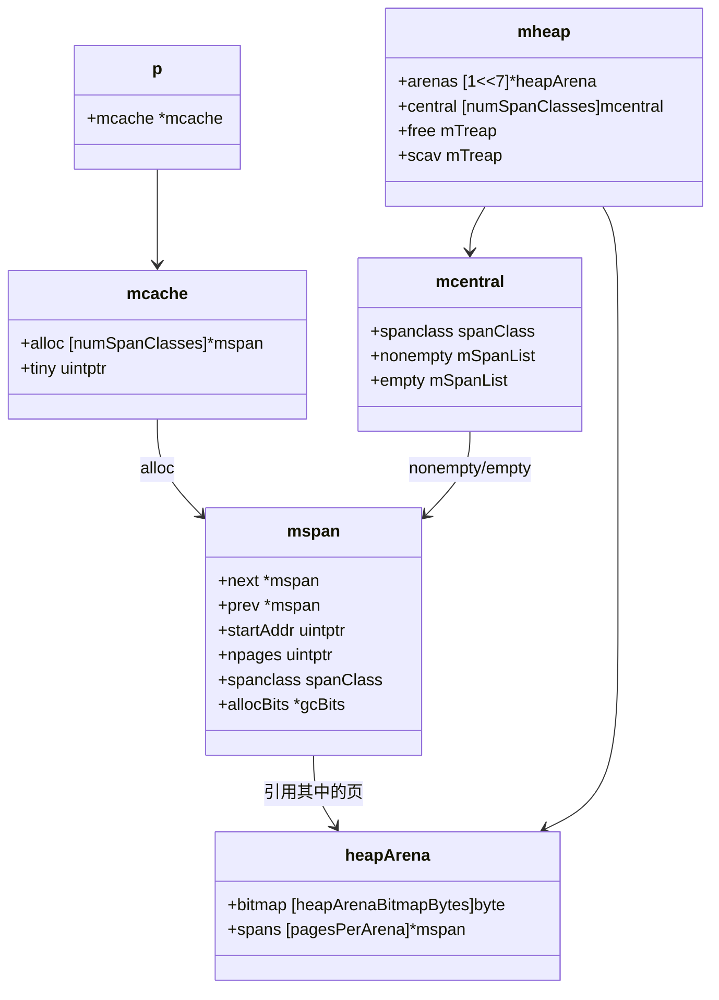

## 栈内存分配与堆内存分配的三级缓存设计对比

Go 运行时在**栈内存分配**和**堆内存分配**中都采用了三级缓存结构，但两者的设计目标和实现细节有显著差异。以下从**设计思想**、**内存划分**、**类图/架构图**三个维度进行对比分析。

### 1. 设计思想是否一致？

| 维度 | 堆内存分配器（mcache → mcentral → mheap） | 栈内存分配器（stackcache → stackpool → stackLarge） |
|------|--------------------------------------------|------------------------------------------------------|
| **核心目标** | 通用对象分配（任意大小），减少 GC 压力 | 专用于 Goroutine 栈的快速分配/释放，支持动态扩容 |
| **缓存层次** | 三级：P 本地（mcache）→ 中心缓存（mcentral）→ 堆（mheap） | 三级：P 本地（stackcache）→ 全局池（stackpool）→ 堆（mheap） |
| **锁竞争** | mcache 无锁，mcentral 有锁，mheap 部分有锁 | stackcache 无锁，stackpool 有锁，stackLarge 有锁 |
| **大小分类** | 67 种 spanClass（8B ~ 32KB），大对象直接分配 | 按栈大小规格（2KB, 4KB, ..., 32KB），>32KB 走 large |
| **回收策略** | GC 清扫后归还到 mcentral，部分归还 OS | Goroutine 结束时放回 stackcache，过长则归还 stackpool |
| **与 GC 交互** | GC 负责清扫未使用对象 | 栈收缩由 GC 触发，栈本身无 GC 标记 |

**结论**：设计思想**基本一致**——都采用“本地缓存 → 全局池 → 堆”三级结构，以减少锁竞争和系统调用。但栈分配器更简化（无需 GC 扫描），且专门针对栈的动态扩容/收缩做了优化。

### 2. 内存划分与体现

#### 2.1 堆内存分配器的内存划分

- **mcache**：每个 P 私有，存储在 `p` 结构体中，是一个 `[numSpanClasses]*mspan` 数组。每个 `mspan` 管理连续页（如 8KB），并切分为固定大小的对象槽位。
- **mcentral**：全局数组，每个 `spanClass` 一个，管理两个 `mspan` 链表（`nonempty` 有空闲槽位，`empty` 无空闲）。
- **mheap**：全局，管理 `heapArena`（64MB 块）和空闲页链表（`free`/`scav`）。

**内存布局**：所有堆对象最终都位于 `heapArena` 中，`mspan` 是中间管理层。

#### 2.2 栈内存分配器的内存划分

- **stackcache**：每个 P 私有的 `[numStackOrders]stackfreelist`，每个 `stackfreelist` 是一个单向链表，每个节点是一个空闲的栈块（如 2KB）。
- **stackpool**：全局数组，每个大小规格一个 `mSpanList`，每个 `mspan` 被切分成多个等大的栈块（例如一个 8KB 的 `mspan` 可切出 4 个 2KB 栈块）。
- **stackLarge**：全局，按页数分级的 `mSpanList`，每个 `mspan` 就是单独一个大栈块（不切分）。

**内存布局**：栈块本身也是从堆上分配的 `mspan`（带有 `spanClass` 标记为栈专用），但通过 `stackalloc`/`stackfree` 接口管理，不经过普通对象分配器。

### 3. 类图 / 架构图

#### 3.1 堆内存分配器架构图



#### 3.2 栈内存分配器架构图

```mermaid
classDiagram
    class p {
        +stackcache [numStackOrders]stackfreelist
    }
    class stackfreelist {
        +list *stackNode
    }
    class stackpool {
        +[_NumStackOrders]struct{
            mu mutex
            list mSpanList
        }
    }
    class stackLarge {
        +lock mutex
        +free [len(stackLargeSize)]mSpanList
    }
    class mspan {
        +spanclass spanClass
        +stackfreelist *stackNode   // 栈专用字段
    }
    
    p --> stackfreelist
    stackfreelist --> stackNode
    stackpool --> mspan
    stackLarge --> mspan
```

### 4. 核心差异总结

| 特性 | 堆分配器 | 栈分配器 |
|------|----------|----------|
| **是否支持动态扩容** | 否（对象大小固定） | 是（栈可增长，需复制） |
| **是否涉及 GC 扫描** | 是（需标记存活对象） | 否（栈由调度器管理，栈上指针在 GC 时扫描） |
| **缓存回收** | GC 清扫后回收 | Goroutine 结束时立即回收 |
| **大对象处理** | 直接从 mheap 分配 | 直接从 stackLarge 分配 |
| **锁粒度** | mcentral 和 mheap 有锁 | stackpool 和 stackLarge 有锁，stackcache 无锁 |

### 5. 设计思想一致性总结

**相同点**：
- 都采用**三级缓存**（本地 → 全局 → 堆）减少锁竞争。
- 都按**大小规格**分类管理，提高分配效率。
- 本地缓存都绑定到 P，实现无锁分配。

**不同点**：
- 栈分配器不需要 GC 标记，分配/释放更简单。
- 栈分配器需要支持**动态扩容**（通过复制栈），而堆分配器对象大小固定。
- 栈分配器的缓存回收更及时（Goroutine 结束即释放），堆分配器依赖 GC 清扫。

因此，可以说两者**设计思想同源**（都源于 TCMalloc），但针对各自的应用场景（对象 vs 栈）做了专门优化。栈分配器更轻量，堆分配器更通用。