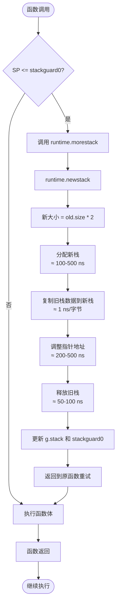
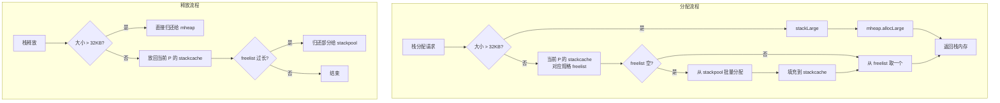

# Go 栈内存管理深度解析：设计原理、逃逸分析与最佳实践

本文档整合了关于 Go 栈内存管理的全部核心知识点，包括栈的设计目标、动态扩容机制、栈分配的三级缓存、逃逸分析的两条不变性、以及常见问题解答。通过图文结合的方式，帮助深入理解 Go 运行时如何高效管理 Goroutine 栈。

## 1. 为什么需要栈内存管理？它主要解决什么问题？

Go 语言的栈内存管理是运行时为每个 Goroutine 分配的**动态栈**，主要解决以下问题：

1. **轻量级 Goroutine 创建**：每个 Goroutine 初始栈很小（约 2KB），使得创建数百万个 Goroutine 成为可能，而不会耗尽内存。
2. **动态扩容**：当 Goroutine 的栈空间不足（如深度递归或大量局部变量）时，运行时自动扩容，避免栈溢出错误。
3. **高效回收**：Goroutine 结束后，栈内存可以快速回收或复用，减少 GC 压力。
4. **避免 C 语言栈溢出问题**：传统线程的栈大小固定（如 1MB），过大浪费内存，过小容易溢出。Go 的动态栈完美平衡了内存和安全性。

## 2. 新老版本设计区别

| 版本 | 关键变化 | 说明 |
|------|----------|------|
| **Go 1.0 - 1.2** | **分段栈 (segmented stack)** | 栈按需分配多个不连续的内存段，通过链表连接。但频繁的栈分裂/合并导致性能问题（“热分裂”问题）。 |
| **Go 1.3** | **连续栈 (contiguous stack)** | 彻底放弃分段栈，改用连续栈。栈扩容时分配一块更大的连续内存，复制原栈内容，然后释放旧栈。解决了热分裂问题。 |
| **Go 1.4** | 栈拷贝优化 | 引入栈拷贝时的写屏障（用于 GC），提高 GC 与栈复制的并发安全性。 |
| **Go 1.6** | 栈大小调整 | 将初始栈大小从 4KB 调整为 2KB，进一步降低 Goroutine 内存占用。 |
| **Go 1.7** | 栈收缩 (shrink) | GC 期间可以收缩不再需要的栈空间，释放内存。 |
| **Go 1.14+** | 异步抢占 | 配合信号抢占，使得栈扩容可以在更多时机安全发生。 |

> 核心演进：从分段栈到连续栈，再到栈收缩，Go 的栈管理越来越高效和可靠。

## 3. 核心数据结构

每个 Goroutine 在运行时对应一个 `g` 结构体，其中包含栈相关的字段：

```go
type g struct {
    stack       stack   // 当前栈区间 [lo, hi)
    stackguard0 uintptr // 用于栈溢出检查的边界值（通常是 lo + StackSmall）
    stackguard1 uintptr // 用于 C 栈的检查（通常等于 stackguard0）
    // ...
}

type stack struct {
    lo uintptr  // 栈的低地址（栈底）
    hi uintptr  // 栈的高地址（栈顶）
}
```

- `stack.lo`：栈空间的起始地址（最低地址，固定）。
- `stack.hi`：栈空间的结束地址（最高地址，随扩容变化）。
- 栈从高地址向低地址增长（`SP` 递减）。

## 4. 栈溢出检查与连续栈扩容

### 4.1 栈溢出检查

每个函数入口处，编译器会插入检查指令：
```asm
CMPQ SP, 0x1000(SP)   // 比较 SP 和 stackguard0
JLS  morestack        // 如果 SP <= stackguard0，则调用 morestack 扩容
```

- `stackguard0` 通常设置为 `stack.lo + StackSmall`（默认 1KB 左右）。当 SP 接近栈底时触发扩容。

### 4.2 连续栈扩容流程

当调用 `morestack` 后，会进入 `runtime.newstack` 函数，执行以下步骤：

1. 计算新栈大小：`old.size * 2`（但不超过 `maxstacksize`，默认 1GB）。
2. 调用 `runtime.stackalloc` 分配新栈内存。
3. 调用 `runtime.memmove` 将旧栈内容复制到新栈（包括所有栈帧）。
4. 调整所有指针（如 `SP`、`BP` 以及栈上指向栈的指针），使其指向新栈的对应位置（通过 `adjustpointers` 函数遍历栈帧的位图）。
5. 释放旧栈内存。
6. 更新 `g.stack` 和 `stackguard0`。

**典型耗时**：
- 分配新栈：≈ 100-500 ns（取决于大小）
- 复制栈数据：取决于栈大小（约 1 ns/字节）
- 调整指针：≈ 200-500 ns
- 释放旧栈：≈ 50-100 ns

### 4.3 栈收缩流程

GC 期间，如果 Goroutine 的栈使用率较低（如实际使用 < 1/4），会调用 `runtime.shrinkstack` 收缩栈：

1. 计算新栈大小：`max(2KB, used * 2)`，但不超过当前大小的一半。
2. 类似扩容流程，分配新栈、复制数据、释放旧栈。

栈收缩减少了长期空闲 Goroutine 的内存占用。

### 4.4 栈扩容流程图



## 5. 栈内存分配的三级缓存

Go 运行时为了高效管理 Goroutine 栈的内存，设计了三级缓存结构：**`stackcache`**（P 本地）、**`stackpool`**（全局小栈池）、**`stackLarge`**（大栈分配）。它们分别对应不同大小的栈分配需求。

### 5.1 三个核心组件

| 组件 | 作用域 | 管理栈大小 | 数据结构 |
|------|--------|------------|----------|
| **`stackcache`** | 每个 P 私有（无锁） | 小栈 ≤ 32KB | 数组，每个元素是一个 `freelist` 链表，对应不同大小规格（2KB、4KB、... 32KB） |
| **`stackpool`** | 全局（使用互斥锁） | 小栈 ≤ 32KB（后备） | 按大小分级的 `mspan` 链表，每个 `mspan` 被切分成多个固定大小的栈块 |
| **`stackLarge`** | 全局（使用互斥锁） | 大栈 > 32KB | 按页数分级的 `mspan` 链表，直接从 `mheap` 分配连续页 |

### 5.2 何时使用哪个组件？

- **分配时**：
  - 所需栈大小 > 32KB → 直接使用 `stackLarge`。
  - 所需栈大小 ≤ 32KB → 优先从当前 P 的 `stackcache` 中对应规格的 `freelist` 取。
  - 若 `stackcache` 中该规格链表为空 → 从 `stackpool` 批量分配一批（通常 16 个）填充到 `stackcache`，然后取一个。
  - 若 `stackpool` 也空 → 向 `mheap` 申请新的 `mspan`（从操作系统获取内存），切分成栈块后加入 `stackpool`。

- **释放时**：
  - 小栈（≤32KB）放回当前 P 的 `stackcache` 对应链表中。
  - 如果 `stackcache` 中该规格链表长度超过某个阈值（如 64），则归还一部分（如 32 个）给 `stackpool`。
  - 大栈（>32KB）直接释放给 `mheap`（不经过 `stackcache` 或 `stackpool`）。

### 5.3 组件交互图



## 6. 逃逸分析与两条不变性

Go 编译器的逃逸分析通过静态检查代码中指针的流向，决定变量分配在**栈**还是**堆**上。其底层遵循两条至关重要的**不变性**：

1. **指向栈对象的指针不能存在于堆中**  
   如果堆上的对象持有一个指向栈上变量的指针，当栈帧被销毁后，这个指针就会变成“悬空指针”（dangling pointer），后续通过堆对象访问栈内存将导致未定义行为（通常表现为内存损坏或程序崩溃）。

2. **指向栈对象的指针不能在栈对象回收后存活**  
   这意味着所有指向栈上变量的指针，其生命周期必须严格短于栈变量本身。一旦函数返回，栈帧被回收，任何指向该栈帧内变量的指针都必须失效。

为了满足这两条不变性，编译器会在编译时分析每个变量的**作用域**和**引用关系**，一旦发现某个变量的指针可能“逃逸”到栈外（例如被返回、赋值给全局变量、被闭包捕获或传递给外部函数），该变量就会被标记为在**堆**上分配。

### 6.1 逃逸分析的典型场景

| 代码模式 | 是否逃逸 | 原因 |
|----------|----------|------|
| 返回局部变量的地址 | ✅ 逃逸 | 违反了不变性2：函数返回后栈帧销毁，但指针仍被外部使用 |
| 将局部变量指针存入全局变量 | ✅ 逃逸 | 违反了不变性1：全局变量在堆上（或静态存储区），指向栈对象 |
| 闭包捕获外部变量 | ✅ 逃逸 | 闭包可能被返回或异步执行，导致外部变量的生命周期延长 |
| 传递指针到外部函数（如 `fmt.Println`） | 视情况 | 如果函数内部将指针存储到堆上，则逃逸；否则可能不逃逸 |
| 局部变量未取地址且未传递给外部 | ❌ 不逃逸 | 变量生命周期完全在函数内，安全分配在栈上 |

### 6.2 示例代码与逃逸分析

```go
func f() *int {
    x := 42
    return &x   // x 逃逸到堆，因为返回了指针
}

func g() {
    y := 100    // y 不逃逸，分配在栈上
    _ = y
}

var global *int

func h() {
    z := 200
    global = &z // z 逃逸，因为指针被赋值给全局变量
}
```

查看逃逸分析结果：
```bash
go build -gcflags="-m" main.go
# 输出：
# ./main.go:5:2: moved to heap: x
# ./main.go:13:2: moved to heap: z
```

## 7. 常见问题解答

### 问题1：多个 Goroutine 操作栈扩容，如何保证不会扩容到同一块内存空间？

Go 运行时通过以下机制确保不同 Goroutine 的栈不会互相冲突：

- **每个 Goroutine 拥有独立的栈空间**：`g.stack` 字段记录了该 Goroutine 栈的起始地址和结束地址。
- **栈分配使用线程安全的内存分配器**：`stackalloc` 通过每 P 的 `stackcache`（无锁）或全局 `stackpool`（加锁）保证线程安全。
- **Goroutine 不会并发执行自己的栈扩容**：栈扩容发生在当前运行的 Goroutine 中，同一 Goroutine 不可能同时在多个 M 上执行。
- **栈内存的隔离性**：每次扩容分配的全新内存块不会与其他 Goroutine 的栈重叠。

### 问题2：栈初始化的三个变量是什么？交互过程？

三个核心变量是 `stackcache`（P 本地）、`stackpool`（全局小栈池）、`stackLarge`（全局大栈分配）。交互过程见第 5 节的组件交互图。

### 问题3：逃逸分析和不变性的关系？

逃逸分析的两条不变性保障了内存安全：**栈指针永不入堆，栈指针生命周期不超出栈帧**。编译器通过静态分析确保这些不变性成立，从而在保证安全的前提下，尽可能将变量分配在栈上，获得最佳性能。

## 8. 最佳实践与注意事项

### 8.1 最佳实践

1. **优先使用值传递而非指针**：小对象值传递可以留在栈上，减少 GC 压力。
2. **避免深度递归**：深度递归会导致多次栈扩容和复制，应转为迭代。
3. **合理使用 `runtime.GOMAXPROCS` 控制并发栈总内存**。
4. **使用 `go build -gcflags="-m"` 检查逃逸**，优化热点路径。
5. **大局部变量考虑使用切片**：`[1024]int` 会占用大量栈空间，改用 `make([]int, 1024)` 分配在堆上。

### 8.2 注意事项

- **栈扩容开销不可忽视**：深度递归会导致多次扩容和复制，应优先使用迭代。
- **栈指针调整**：栈复制时，所有指向栈上对象的指针都会被调整。如果使用 `unsafe` 包持有栈上指针，可能导致野指针（应避免）。
- **栈与 GC 的交互**：GC 需要扫描所有 Goroutine 的栈，栈越大，GC 停顿时间越长。
- **栈收缩可能不立即发生**：只有 GC 期间才会检查并收缩栈，长时间空闲的 Goroutine 可能仍持有较大栈。
- **`recover` 和栈**：`panic` 和 `recover` 会遍历栈帧，不影响栈大小。

## 9. 关联知识

| 关联模块 | 关系 | 如何协同工作 |
|----------|------|--------------|
| **Goroutine 调度器** | 每个 G 拥有独立栈，调度器负责切换栈。 | 调度器在 `gogo` 函数中切换 SP 到新 G 的栈。 |
| **垃圾回收（GC）** | GC 需要扫描栈上的指针，栈扩容时需同步 GC 状态。 | 栈扩容时如果 GC 正在扫描，会等待；栈收缩由 GC 触发。 |
| **内存分配器** | 栈内存本质上是堆上特殊的 `mspan`。 | 栈分配通过 `stackalloc` 使用内存分配器的三级缓存。 |
| **逃逸分析** | 决定对象分配在栈还是堆。 | 逃逸分析结果直接影响栈管理的工作负载。 |
| **`unsafe` 包** | 操作栈指针危险。 | 栈复制后，`unsafe.Pointer` 保存的地址可能失效。 |

## 10. 总结

Go 的栈内存管理通过**连续栈**设计，解决了分段栈的“热分裂”性能问题。每个 Goroutine 初始栈仅 2KB，可按需动态扩容（最大 1GB），并在 GC 期间智能收缩，实现了内存占用和性能的完美平衡。栈分配采用三级缓存（`stackcache` → `stackpool` → `stackLarge`），确保高效的无锁分配。逃逸分析的两条不变性保障了栈内存的安全，使得编译器可以安全地将变量分配在栈上。理解这些机制有助于编写高效的 Go 程序，避免深度递归和滥用指针带来的性能问题。

> 注：本文档基于 Go 1.18~1.22 源码分析，时间数据为典型量级，实际因硬件和负载而异。建议查看 `runtime/stack.go` 源码。