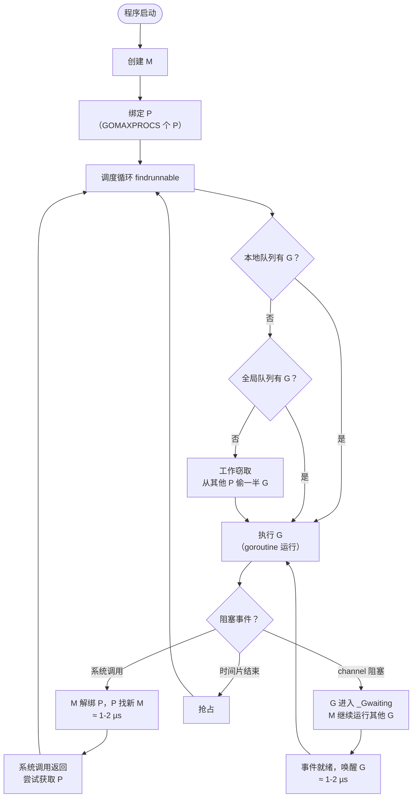
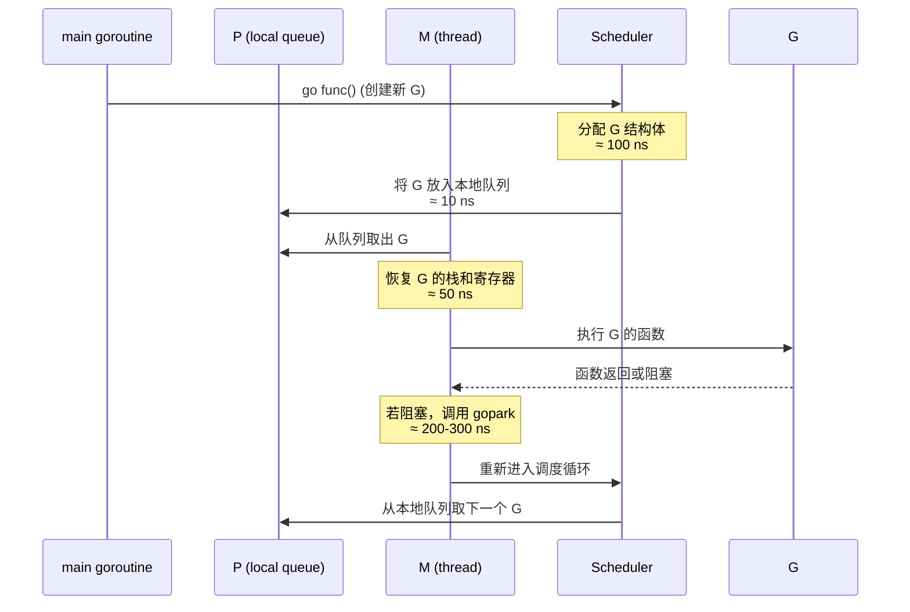
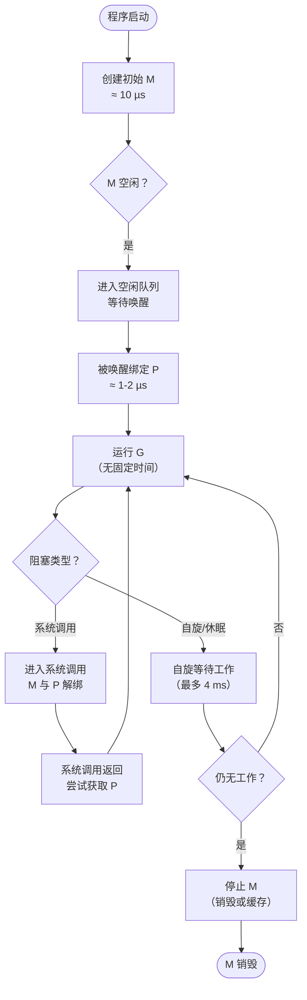

# Go 语言 Goroutine 实现原理、版本演进与使用指南

Goroutine 是 Go 语言并发模型的核心，它是由 Go 运行时管理的轻量级用户态线程。相比操作系统线程，Goroutine 的创建、切换和销毁成本极低，使得 Go 能够轻松处理成千上万个并发任务。

## 1. 新老版本设计区别

| 版本 | 关键特性 | 说明 |
|------|----------|------|
| **Go 1.0** | G-M 模型 | 仅有 Goroutine（G）和系统线程（M），全局运行队列+互斥锁，并发性能差。 |
| **Go 1.1** | **引入 P（处理器）** | 每个 P 拥有本地运行队列，大幅减少锁竞争，并发性能提升约 300%。 |
| **Go 1.2** | 抢占式调度雏形 | 基于协作的抢占（函数调用时检查），但仍存在死循环无法抢占问题。 |
| **Go 1.5** | 改进调度器 + 工作窃取 | 实现工作窃取（work-stealing）算法，提升负载均衡；`GOMAXPROCS` 默认值改为 CPU 核数。 |
| **Go 1.6** | 抢占增强 | 增加 sysmon 检测阻塞时间，可抢占长时间运行的 Goroutine。 |
| **Go 1.10** | 更精确的抢占 | 优化抢占信号处理。 |
| **Go 1.14** | **基于信号的异步抢占** | 彻底解决死循环无法抢占的问题，通过信号（SIGURG）强制抢占。 |
| **Go 1.15** | 调度器细微优化 | 减少锁竞争，提升大规模并发下的性能。 |
| **Go 1.18+** | 泛型支持 + 调度器稳定 | 调度器核心逻辑保持稳定，主要优化内存和锁。 |

## 2. 调度器设计原理：GMP 模型

### 2.1 核心数据结构

```go
// G - Goroutine
type g struct {
    stack       stack   // 栈内存（初始 2KB）
    stackguard0 uintptr // 栈溢出检查边界
    sched       gobuf   // 保存调度上下文（PC, SP, BP）
    status      uint32  // 状态（_Gidle, _Grunnable, _Grunning, _Gsyscall, _Gwaiting, _Gdead）
    goid        int64   // goroutine ID
    atomicstatus uint32 // 原子状态
    m           *m      // 当前绑定的 M
    // ... 其他字段
}

// M - 系统线程
type m struct {
    g0      *g     // 调度栈（特殊 goroutine，用于执行调度代码）
    curg    *g     // 当前运行的 goroutine
    p       *p     // 当前绑定的 P
    nextp   *p     // 下一个绑定的 P（用于唤醒）
    oldp    *p     // 系统调用前的 P
    spinning bool  // 是否正在寻找工作
    // ...
}

// P - 逻辑处理器
type p struct {
    id          int32
    status      uint32 // _Pidle, _Prunning, _Psyscall, _Pgcstop, _Pdead
    m           *m     // 反向链接的 M
    runqhead    uint32 // 本地运行队列头
    runqtail    uint32 // 本地运行队列尾
    runq        [256]guintptr // 本地运行队列（环形数组）
    runnext     guintptr // 下一个要运行的 G（优先级最高）
    // ...
}
```

### 2.2 调度器执行机制（附典型耗时）

#### 整体调度循环（M 调度 P，P 调度 G）



#### 典型操作时间消耗

| 操作 | 典型耗时 | 说明 |
|------|----------|------|
| 创建 Goroutine | ≈ 200-300 ns | `go func()`，不含函数体执行 |
| 切换 Goroutine | ≈ 100-150 ns | 保存/恢复寄存器、栈 |
| 阻塞/唤醒 | ≈ 1-2 µs | `gopark` / `goready` |
| 工作窃取 | ≈ 50-100 ns | 从一个 P 偷取一半 G |
| 系统调用进入/退出 | ≈ 1-2 µs | 涉及 P 解绑和重新绑定 |

### 2.3 完整时序图（创建到执行）



## 3. 注意事项

### 3.1 Goroutine 泄漏
- 常见场景：channel 发送/接收未关闭、select 阻塞无超时、无限循环未退出。
- 检测：`pprof` 的 `goroutine` profile。

### 3.2 栈内存管理
- 初始栈大小：2KB（1.4 以前为 8KB）。
- 栈扩容：按需增长（2 倍，直到最大 1GB），涉及栈拷贝（≈ 200-300 ns + 数据拷贝）。
- 栈收缩：GC 时检测并收缩。

### 3.3 GOMAXPROCS 设置
- 默认等于 CPU 核数（`runtime.NumCPU()`）。
- 过大：增加调度器开销和锁竞争。
- 过小：无法充分利用多核。

### 3.4 抢占时机
- 协作抢占：函数调用、channel 操作、系统调用等。
- 异步抢占（Go 1.14+）：通过信号（SIGURG）在任意指令点暂停，避免死循环。

### 3.5 系统调用影响
- 阻塞系统调用会导致 M 与 P 解绑，P 会绑定新 M 继续运行其他 G。
- 长时间系统调用会增加 P 数量和内存占用。

## 4. 关联知识

| 关联模块 | 关系 |
|----------|------|
| **Channel** | 阻塞/唤醒 goroutine 的核心机制（`gopark` / `goready`）。 |
| **Select** | 多路复用 channel，使用 `selectgo` 调度。 |
| **Syscall** | 系统调用时 M 会释放 P，P 寻找新 M 或空闲 M。 |
| **Netpoller** | 网络 I/O 通过 epoll/kqueue 实现非阻塞，避免 M 阻塞。 |
| **GC** | 垃圾回收时需要停止所有 goroutine（STW），调度器参与暂停。 |
| **Pprof** | 用于分析 goroutine 堆栈和阻塞情况。 |

## 5. 最佳实践（含代码）

### 5.1 控制并发数（使用带缓冲 channel 或 semaphore）

```go
// 限制最大并发 goroutine 数为 10
func limitedConcurrency() {
    sem := make(chan struct{}, 10)
    for i := 0; i < 100; i++ {
        sem <- struct{}{} // 获取令牌
        go func(id int) {
            defer func() { <-sem }() // 释放令牌
            // 实际任务
            time.Sleep(100 * time.Millisecond)
            fmt.Println("done", id)
        }(i)
    }
    // 等待所有完成
    for i := 0; i < 10; i++ {
        sem <- struct{}{}
    }
}
```

### 5.2 使用 `context` 实现超时和取消

```go
func worker(ctx context.Context) {
    for {
        select {
        case <-ctx.Done():
            fmt.Println("worker exiting:", ctx.Err())
            return
        default:
            // 模拟工作
            time.Sleep(50 * time.Millisecond)
        }
    }
}

func main() {
    ctx, cancel := context.WithTimeout(context.Background(), 2*time.Second)
    defer cancel()
    go worker(ctx)
    time.Sleep(3 * time.Second) // 等待超时
}
```

### 5.3 避免 Goroutine 泄漏：确保 channel 关闭

```go
func produce(ch chan<- int) {
    for i := 0; i < 10; i++ {
        ch <- i
    }
    close(ch) // 重要：关闭 channel，通知消费者
}

func consume(ch <-chan int) {
    for v := range ch { // 自动在 channel 关闭且空时退出
        fmt.Println(v)
    }
}
```

### 5.4 使用 `sync.WaitGroup` 等待一组 goroutine

```go
func main() {
    var wg sync.WaitGroup
    for i := 0; i < 10; i++ {
        wg.Add(1)
        go func(id int) {
            defer wg.Done()
            fmt.Println(id)
        }(i)
    }
    wg.Wait() // 等待所有完成
}
```

### 5.5 合理设置 `GOMAXPROCS`

```go
import "runtime"

func main() {
    // 默认等于 CPU 核数
    fmt.Println("GOMAXPROCS:", runtime.GOMAXPROCS(0))
    // 可以手动设置（不推荐）
    runtime.GOMAXPROCS(8)
}
```

### 5.6 使用 `runtime.Goexit` 提前退出 goroutine

```go
func main() {
    go func() {
        defer fmt.Println("defer in goroutine")
        fmt.Println("before Goexit")
        runtime.Goexit() // 立即终止当前 goroutine，执行 defer
        fmt.Println("after Goexit") // 不会执行
    }()
    time.Sleep(100 * time.Millisecond)
}
```

## 6. 线程生命周期（M 的生命周期，附时间）



**典型时间点**：
- 创建 M：≈ 10-20 µs（包括分配内核线程栈）
- 唤醒空闲 M：≈ 1-2 µs（从空闲队列取出并绑定 P）
- M 自旋等待：最多 4 ms（避免频繁创建销毁）
- M 销毁：由内核回收，无明显开销。

## 7. 总结

Goroutine 是 Go 并发模型的基石，GMP 调度器通过 P 的本地队列和工作窃取实现了高效的负载均衡。Go 1.14+ 的异步抢占解决了死循环无法抢占的问题。使用 goroutine 时应注意避免泄漏、合理设置并发数、利用 context 进行超时控制，并优先使用 channel 进行通信。理解调度器的内部机制有助于编写高性能的并发程序。

> 注：本文档基于 Go 1.18~1.22 源码及官方设计文档，具体时间消耗为典型量级，实际因 CPU、内存、负载而异。建议查看 `runtime/proc.go` 和 `runtime/asm_amd64.s`。