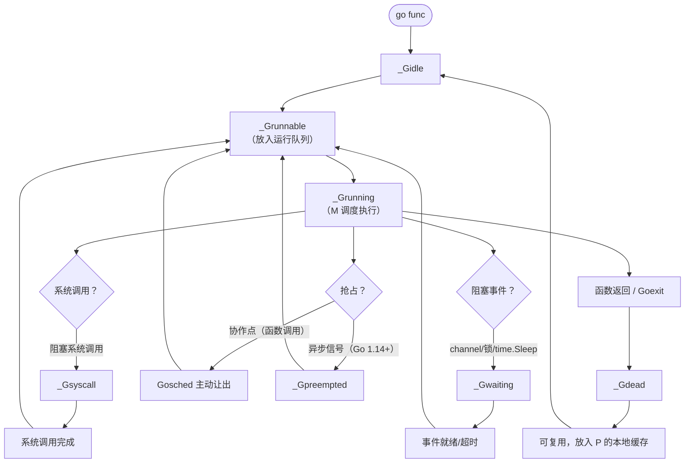

# Go 语言 Goroutine 状态转换、调度机制与并发原语深度解析

## 1. Goroutine 状态及转换流程

Goroutine 在运行时生命周期中有多个状态，核心状态包括：**空闲（_Gidle）**、**可运行（_Grunnable）**、**运行中（_Grunning）**、**等待中（_Gwaiting）**、**系统调用（_Gsyscall）**、**栈复制（_Gcopystack）**、**终止（_Gdead）**。通常可归纳为三大类：**等待中**（_Gwaiting、_Gsyscall、_Gpreempted）、**可运行**（_Grunnable）、**运行中**（_Grunning）。

### 1.1 状态定义与触发条件

| 状态 | 含义 | 触发条件 |
|------|------|----------|
| **_Gidle** | 刚分配，尚未初始化 | `go` 语句创建新 goroutine |
| **_Grunnable** | 已就绪，等待运行 | 新建后、阻塞结束、系统调用返回、被唤醒 |
| **_Grunning** | 正在执行 | 调度器从运行队列取出并执行 |
| **_Gwaiting** | 阻塞等待某个条件 | channel 操作、`time.Sleep`、`sync.Cond.Wait`、锁竞争等 |
| **_Gsyscall** | 正在执行系统调用 | 执行阻塞系统调用（如 `read`、`write`） |
| **_Gpreempted** | 被异步抢占 | 信号抢占（Go 1.14+） |
| **_Gcopystack** | 栈扩容/收缩中 | 栈空间不足或 GC 触发栈收缩 |
| **_Gdead** | 已终止，可复用 | 函数返回、`runtime.Goexit` |

### 1.2 状态转换流程图



> **注意**：_Gsyscall 与 _Gwaiting 的区别：_Gsyscall 表示正在执行内核态系统调用，M 会与 P 解绑；_Gwaiting 是用户态阻塞（如 channel），M 继续运行其他 G。

## 2. 系统调用造成的阻塞详解

当 Goroutine 执行**阻塞系统调用**（如文件 I/O、`time.Sleep` 底层使用的 `nanosleep`）时，Go 调度器会将当前 M 与 P 解绑，让 P 绑定其他 M 继续运行队列中的 G，避免浪费 CPU。

### 2.1 执行流程

1. G 进入 _Gsyscall 状态。
2. 当前 M 释放绑定的 P，P 被标记为 _Pidle 并放入空闲队列。
3. M 带着 G 进入系统调用（内核态）。
4. 系统调用返回后，M 尝试重新获取一个 P：
   - 若成功，G 重新变为 _Grunnable 并继续执行。
   - 若失败（无空闲 P），G 被放入全局运行队列，M 进入空闲休眠。

### 2.2 代码示例

```go
package main

import (
    "fmt"
    "os"
    "runtime"
    "time"
)

func main() {
    runtime.GOMAXPROCS(1) // 仅一个 P，便于观察
    fmt.Println("启动监控...")
    go func() {
        for {
            fmt.Println("Goroutine A 运行中")
            time.Sleep(500 * time.Millisecond)
        }
    }()
    time.Sleep(1 * time.Second)

    // 执行阻塞系统调用（读取文件）
    go func() {
        fmt.Println("Goroutine B 开始系统调用")
        f, _ := os.Open("/dev/urandom") // 可能短暂阻塞，但足够演示
        b := make([]byte, 1)
        f.Read(b)
        f.Close()
        fmt.Println("Goroutine B 系统调用结束")
    }()

    time.Sleep(3 * time.Second)
}
```

**预期行为**：当 B 执行 `Read` 系统调用时，即使只有一个 P，A 依然可以继续运行，因为 M 与 P 解绑后，P 会寻找其他 M（或创建新 M）来运行 A。

## 3. 调度器主动挂起与抢占场景

### 3.1 主动挂起：`runtime.gopark` -> `runtime.park_m`

- **触发场景**：channel 阻塞、`time.Sleep`、`sync.Mutex` 竞争失败、`select` 无 default 阻塞等。
- **执行流程**：调用 `gopark` 将当前 G 从 _Grunning 变为 _Gwaiting，然后 M 调用 `park_m` 解绑 G，重新调度下一个 G。

```go
// 示例：channel 阻塞
ch := make(chan int)
go func() {
    <-ch // 这里会调用 gopark
}()
```

### 3.2 系统调用退出：`runtime.exitsyscall` -> `runtime.exitsyscall0`

- **触发场景**：系统调用返回后，G 从 _Gsyscall 恢复。
- **执行流程**：`exitsyscall` 尝试获取 P，若成功则直接继续运行；否则调用 `exitsyscall0` 将 G 放回全局队列，M 进入休眠。

### 3.3 协作式调度：`runtime.Gosched` -> `runtime.gosched_m` -> `runtime.goschedImpl`

- **触发场景**：用户主动调用 `runtime.Gosched()`，让出当前 P 的执行权。
- **执行流程**：当前 G 变为 _Grunnable 并放回本地队列，M 重新调度其他 G。

```go
func main() {
    for i := 0; i < 10; i++ {
        go func(id int) {
            for {
                fmt.Println(id)
                runtime.Gosched() // 主动让出
            }
        }(i)
    }
    time.Sleep(time.Second)
}
```

### 3.4 系统监控：`runtime.sysmon` -> `runtime.retake` -> `runtime.preemptone`

- **触发场景**：长时间运行的 G（无函数调用，无法协作抢占）。
- **执行流程**：`sysmon` 是一个独立的后台监控线程，定期检查：
  - 若 G 在 _Grunning 状态超过 10ms，且当前 P 没有进行系统调用，则发送抢占信号（SIGURG），触发 `preemptone` 强制该 G 让出。
- **版本差异**：Go 1.14 之前依赖协作抢占，死循环会卡死；1.14+ 通过信号抢占解决。

## 4. sync 包与 Channel 在 GMP 模型下的工作方式

### 4.1 Channel 的阻塞与唤醒

- **发送/接收阻塞**：当 channel 缓冲区满或空时，G 调用 `gopark` 进入 _Gwaiting，并挂在 channel 的 `sendq` 或 `recvq` 队列。
- **唤醒**：当条件满足（如缓冲区有空间），调度器通过 `goready` 将等待队列中的 G 变为 _Grunnable，放入本地运行队列。

### 4.2 sync.Mutex 的工作机制

- **加锁失败**：Mutex 的 `Lock` 方法在 CAS 和自旋失败后，调用 `gopark` 将 G 挂起，并加入 Mutex 的等待队列。
- **解锁唤醒**：`Unlock` 时通过信号量（`sema`）唤醒等待队列中的 G，使其进入 _Grunnable。

### 4.3 线程锁 vs sync.Mutex

| 对比项 | 线程锁（OS 级，如 pthread_mutex） | sync.Mutex |
|--------|----------------------------------|------------|
| 实现层 | 内核态，通过 futex 或互斥量 | 用户态，通过 CAS + 自旋 + 信号量 |
| 阻塞方式 | 线程进入内核阻塞，上下文切换 | Goroutine 用户态阻塞（gopark），M 可执行其他 G |
| 开销 | 较重（1-10 µs） | 较轻（无竞争时 ≈ 5-10 ns，有竞争时 ≈ 200 ns - 1 µs） |
| 适用场景 | 与 C 库交互、必须线程级阻塞 | Go 原生并发 |

> **核心区别**：`sync.Mutex` 挂起的是 Goroutine 而非操作系统线程，因此不会导致线程上下文切换，性能更高。

## 5. 补充知识点：本地队列与全局队列

### 5.1 运行队列体系

Go 调度器维护两类运行队列：

- **处理器本地运行队列（P's local queue）**：每个 P 拥有一个容量为 256 的环形队列（`runq`），存储 _Grunnable 的 G。访问本地队列无需锁，性能极高。
- **调度器全局运行队列（Global run queue）**：当本地队列满或发生某些调度事件（如系统调用返回后无 P）时，G 会放入全局队列。全局队列使用锁保护。

**规则**：创建新 G 时优先放入当前 P 的本地队列；若本地队列已满，则将一半 G 放入全局队列。

### 5.2 公平性机制：1/61 的概率从全局队列取 G

为了防止全局队列中的 G 被饿死，调度器在每次从本地队列获取 G 时，会以 **1/61** 的概率（`schedtick` 计数器）主动检查全局队列，并从中取一个 G 运行。

```go
// runtime/proc.go 简化逻辑
func schedule() {
    if gp == nil {
        // 每 61 次调度，检查一次全局队列
        if _g_.m.p.ptr().schedtick%61 == 0 && sched.runqsize > 0 {
            gp = globrunqget(_g_.m.p.ptr(), 1)
        }
    }
    if gp == nil {
        gp, _ = runqget(_g_.m.p.ptr()) // 从本地队列取
    }
    // ...
}
```

这个设计保证了即使本地队列有大量 G，全局队列中的任务也能被及时调度，避免饥饿。

## 6. 总结

Goroutine 的状态转换是调度器的核心逻辑，从创建（_Gidle）到可运行（_Grunnable），再到运行（_Grunning），以及因阻塞或系统调用进入等待（_Gwaiting/_Gsyscall），最终终止（_Gdead）。系统调用通过解绑 P 避免阻塞其他 G；`sync.Mutex` 与 channel 均依赖 `gopark` 实现用户态阻塞，比线程锁轻量。调度器通过本地队列+全局队列+公平性机制，实现了高吞吐和低延迟的并发调度。

理解这些机制，有助于编写高效的并发程序，并诊断 Goroutine 泄漏、死锁等问题。

在 Go 语言中，**递归调用的函数始终运行在同一个 Goroutine 中**，不会为每一层递归调用创建新的 Goroutine。递归调用本质是函数调用链，通过**栈帧（stack frame）** 的压栈和出栈实现，完全在一个 Goroutine 的栈空间内完成。

### 具体原理

- 每个 Goroutine 启动时拥有一个独立的栈（初始约 2KB），栈可动态增长。
- 当函数递归调用自身时，每次调用都会在当前 Goroutine 的栈上**压入一个新的栈帧**（包含局部变量、返回地址等）。
- 递归返回时，依次弹出栈帧，恢复执行。
- 整个过程**不涉及调度器或新 Goroutine 的创建**，因此也不会有额外的 goroutine 调度开销。

### 示例代码

```go
package main

import (
    "fmt"
    "runtime"
)

func recursive(n int) {
    if n <= 0 {
        return
    }
    fmt.Printf("depth: %d, goroutine id: %d\n", n, runtime.GetGoroutineID()) // 需要自定义获取 goroutine id 的函数（此处仅为示意）
    recursive(n - 1)
}

func main() {
    fmt.Println("main goroutine id:", runtime.GetGoroutineID())
    recursive(3)
}
```

输出类似：
```
main goroutine id: 1
depth: 3, goroutine id: 1
depth: 2, goroutine id: 1
depth: 1, goroutine id: 1
```
可见所有递归调用都在同一个 Goroutine（id=1）中执行。

### 注意事项

- **栈空间管理**：Go 的栈是动态增长的（按需扩容，2倍倍增，最大约 1GB），因此递归深度通常受限于内存而非固定栈大小。但过深的递归（例如数十万层）仍可能导致栈溢出或性能问题。
- **性能**：递归调用本身比循环稍慢（函数调用开销），但不会因创建大量 Goroutine 而恶化。
- **并发递归**：如果需要在递归中实现并发（例如分治并行），必须显式使用 `go func()` 启动新 Goroutine。例如快速排序的并行版本会在递归分割时启动新的 Goroutine 处理子任务。

### 总结

- **一个 Goroutine 负责执行整个递归调用链**，不会为每层递归创建新 Goroutine。
- 递归深度受限于 Goroutine 的栈容量（可动态增长，但有限）。
- 如需并发递归，需手动使用 `go` 关键字创建新 Goroutine。