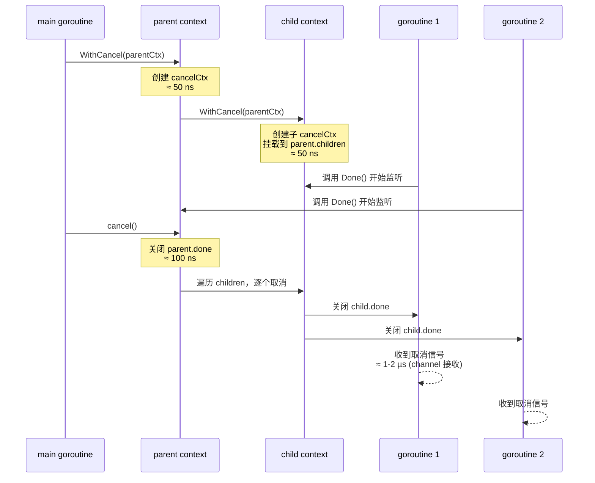
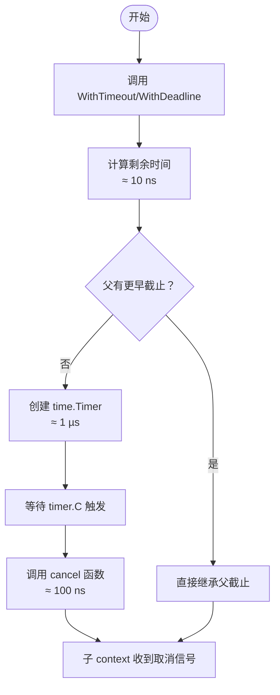
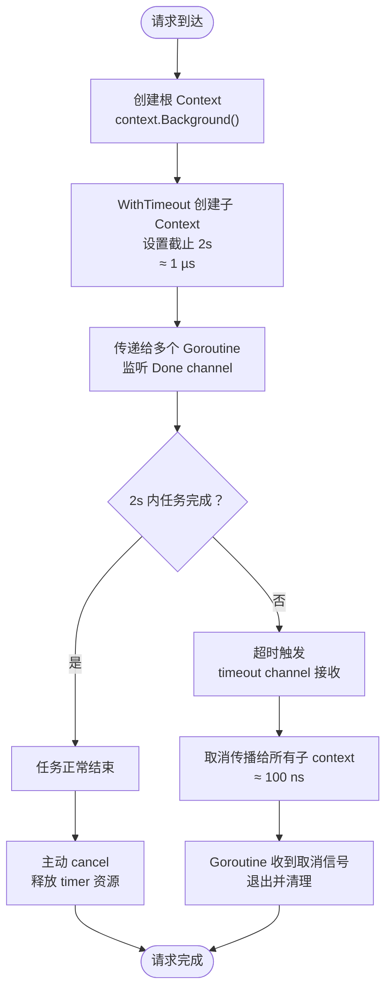

# Go 语言 Context 实现原理、版本演进与使用指南

## 0. 为什么需要 Context？

Go 语言引入 `context` 包主要是为了解决**并发任务中的取消、超时控制和请求范围数据的传递**问题。具体来说，它提供了三种核心能力：

1. **取消信号传播**：当一个请求被用户取消、超时或出错时，需要通知所有处理该请求的 goroutine 停止工作，释放资源。`context` 通过 `Done()` 返回的 channel 统一发送取消信号，父 context 取消时会自动传播给所有子 context。

2. **截止时间和超时控制**：在分布式系统或 API 调用中，需要为操作设置最大执行时间（如“2 秒内必须返回”）。`context.WithTimeout` 和 `context.WithDeadline` 可以轻松实现超时控制，超时后自动触发取消。

3. **请求范围数据传递**：在调用链中传递请求唯一的元数据（如 trace ID、用户身份、认证 token），避免使用全局变量或侵入式修改函数签名。`context.WithValue` 提供了一种类型安全的键值存储方式。

**核心场景**：在 Web 服务器、gRPC 服务、数据库查询等操作中，一个请求会启动多个 goroutine（如读取 DB、调用下游 API、计算）。当客户端断开连接或超时时，需要快速释放所有相关资源。如果没有 `context`，开发者需要手动传递一个 `done` channel 或 `stop` 标志，容易遗漏且代码复杂。`context` 标准化了这种模式，使得库（如 `database/sql`、`net/http`、`grpc`）可以直接集成取消和超时功能，简化并发控制。

## 1. 新老版本设计区别

| 版本 | 关键特性 | 说明 |
|------|----------|------|
| **Go 1.7** | 正式引入 `context` 包 | 将 `golang.org/x/net/context` 移入标准库，提供 `WithCancel`、`WithDeadline`、`WithTimeout`、`WithValue` |
| **Go 1.8** | 增加 `http.Request.WithContext` | 将 context 集成到 HTTP 服务器，支持请求级超时/取消 |
| **Go 1.9** | 优化 `Context` 取消传播 | 减少锁竞争，提升并发性能 |
| **Go 1.13** | 新增 `Context.Err` 错误包装 | 支持 `errors.Is` 和 `errors.As`，错误识别更灵活 |
| **Go 1.15** | 改进 `WithCancel` 内存释放 | 取消后及时释放内部结构，减少内存占用 |
| **Go 1.17+** | 增加 `WithoutCancel` | 提供一种不继承父 context 取消信号的新函数（`context.WithoutCancel`） |

## 2. 设计原理与数据结构

### 2.1 核心数据结构

```go
// Context 接口
type Context interface {
    Deadline() (deadline time.Time, ok bool) // 返回截止时间
    Done() <-chan struct{}                   // 返回取消通知 channel
    Err() error                              // 返回取消原因（Canceled 或 DeadlineExceeded）
    Value(key interface{}) interface{}       // 获取关联的值
}

// 私有实现结构体（以 cancelCtx 为例）
type cancelCtx struct {
    Context                     // 嵌入父 Context
    mu       sync.Mutex
    done     chan struct{}      // 关闭时通知所有子 context
    children map[canceler]struct{}
    err      error
}

// timerCtx 在 cancelCtx 基础上增加定时器
type timerCtx struct {
    cancelCtx
    timer *time.Timer
    deadline time.Time
}

// valueCtx 存储键值对
type valueCtx struct {
    Context
    key, val interface{}
}
```

### 2.2 设计原则

- **不可变性**：Context 是只读的，创建子 Context 时生成新实例。
- **传播取消**：父 Context 取消时，所有派生子 Context 都会被取消。
- **线程安全**：多个 Goroutine 可并发访问同一个 Context。
- **仅用于 API 边界**：通常作为函数的第一个参数传递。

## 3. 执行机制（含典型耗时）

### 3.1 取消传播流程（时序图）



### 3.2 WithTimeout / WithDeadline 机制



## 4. 最佳实践案例（含代码）

### 4.1 超时控制

```go
func main() {
    ctx, cancel := context.WithTimeout(context.Background(), 2*time.Second)
    defer cancel() // 确保资源释放

    resultCh := make(chan int)
    go longRunningTask(ctx, resultCh)

    select {
    case res := <-resultCh:
        fmt.Println("result:", res)
    case <-ctx.Done():
        fmt.Println("timeout:", ctx.Err())
    }
}

func longRunningTask(ctx context.Context, resultCh chan<- int) {
    select {
    case <-time.After(5 * time.Second): // 模拟长任务
        resultCh <- 42
    case <-ctx.Done():
        // 任务取消，清理资源
        return
    }
}
```

### 4.2 跨 API 传递请求级元数据

```go
type requestIDKey struct{}

func middleware(next http.HandlerFunc) http.HandlerFunc {
    return func(w http.ResponseWriter, r *http.Request) {
        reqID := r.Header.Get("X-Request-ID")
        ctx := context.WithValue(r.Context(), requestIDKey{}, reqID)
        next(w, r.WithContext(ctx))
    }
}

func handler(w http.ResponseWriter, r *http.Request) {
    reqID := r.Context().Value(requestIDKey{}).(string)
    w.Write([]byte("Request ID: " + reqID))
}
```

### 4.3 并发控制（多个子任务，任一失败则全部取消）

```go
func runConcurrentTasks(ctx context.Context, tasks []func(ctx context.Context) error) error {
    ctx, cancel := context.WithCancel(ctx)
    defer cancel()

    errCh := make(chan error, len(tasks))
    for _, task := range tasks {
        go func(t func(ctx context.Context) error) {
            errCh <- t(ctx)
        }(task)
    }

    for i := 0; i < len(tasks); i++ {
        if err := <-errCh; err != nil {
            return err // 第一个错误触发取消，其他任务会收到 ctx.Done()
        }
    }
    return nil
}
```

## 5. 注意事项

### 5.1 务必调用 cancel 函数

- 使用 `WithCancel`、`WithTimeout`、`WithDeadline` 创建的子 Context，**必须调用返回的 cancel 函数**，否则父 Context 即使取消，子 Context 也会泄漏内存（timer 资源未释放）。
- 推荐使用 `defer cancel()`。

### 5.2 Context 作为值传递，而非指针

- 应通过值传递 Context，每个函数调用层创建新的子 Context 时，不会修改原 Context。

### 5.3 不要将 Context 存储在结构体中

- 应将 Context 作为函数的第一个参数显式传递，而不是存储在结构体中。这符合 Go 的惯例，便于链路追踪。

### 5.4 仅用于 API 边界和请求范围的数据

- Context 适合传递请求级元数据（如 trace ID、认证 token），不适合传递可选参数或业务数据。
- 使用自定义类型作为 key，避免冲突：
  ```go
  type myKey struct{}
  ctx := context.WithValue(parent, myKey{}, "value")
  ```

### 5.5 取消信号只传递一次

- `ctx.Done()` 返回的 channel 只在取消时关闭一次，不会重复关闭。多次调用 `cancel` 是安全的（幂等）。

### 5.6 不要在 Context 中存储可变对象

- 多 Goroutine 同时访问 Context 中的值必须是只读的，否则需要外部同步。

## 6. 关联知识

| 关联模块 | 关系 |
|----------|------|
| **Goroutine** | Context 常与 Goroutine 一起使用，通过 `select` + `<-ctx.Done()` 实现优雅退出 |
| **Channel** | Context 的取消通知通过 channel 关闭实现（`Done()` 返回只读 channel） |
| **Timer** | `WithTimeout` 底层使用 `time.Timer` 实现超时取消 |
| **HTTP 服务器** | `http.Request.Context()` 提供每个请求的 Context，超时设置通过 `http.Server.ReadTimeout` 等或自定义 |
| **database/sql** | 查询方法（如 `QueryContext`）接收 Context，支持超时和取消 |
| **gRPC** | gRPC 方法第一个参数是 Context，用于传递截止时间、元数据、取消信号 |

## 7. Context 生命周期（带时间）




**典型时间节点**：
- 创建 Context：≈ 50 ns
- 设置 Timer：≈ 1 µs
- 取消传播（单层）：≈ 100 ns
- Goroutine 检测到取消：≈ 1-2 µs（channel 接收）

## 8. 总结

Context 是 Go 并发编程中用于传递取消信号、截止时间和请求级元数据的标准方式。Go 1.7 正式引入，后续版本持续优化性能和内存。使用时应遵循“第一个参数传递、不存储、必须 cancel、值只读”等原则。Context 与 Goroutine、Channel、Timer、HTTP、gRPC 等紧密关联，是构建健壮、可取消的并发系统的基础工具。

> 注：本文档基于 Go 1.18~1.22 源码及官方文档，时间数据为典型量级，实际因 CPU、内存而异。建议查看 `context` 标准库源码。