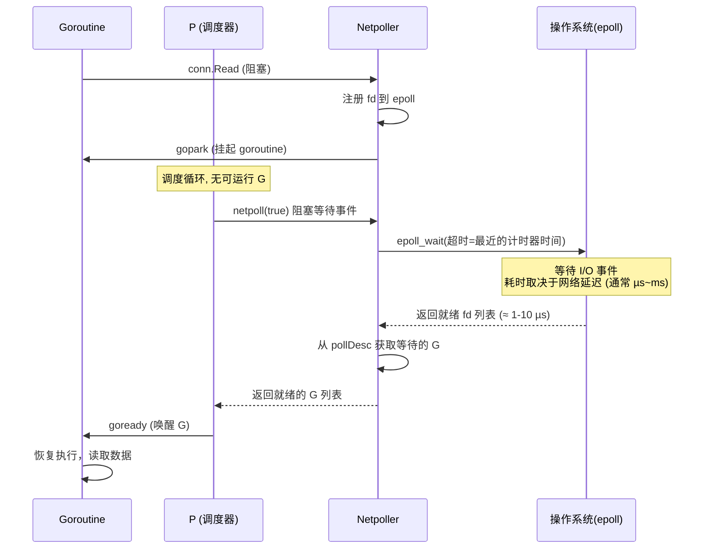
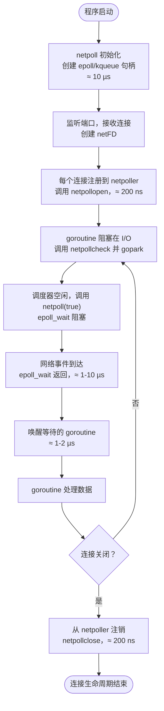

# Go 语言网络轮询器（Netpoller）实现原理、版本演进与使用指南

## 0. 为什么需要网络轮询器？它主要解决什么问题？

Go 语言中的网络轮询器（netpoller）是**运行时实现高性能网络 I/O 的核心组件**，主要解决以下问题：

1. **避免“一个连接一个线程”的 C10K 问题**：传统的阻塞 I/O 模型为每个连接创建一个操作系统线程，当并发连接数达到成千上万时，线程上下文切换和内存开销极大。netpoller 基于操作系统的多路复用机制（epoll、kqueue、IOCP）实现 **非阻塞 I/O**，使用少量线程管理海量连接。

2. **将 I/O 事件与 Goroutine 调度结合**：当 goroutine 执行阻塞的网络操作（如 `conn.Read`）时，运行时不会阻塞底层线程，而是将文件描述符注册到 netpoller，然后挂起该 goroutine；待 I/O 事件就绪后，netpoller 唤醒对应的 goroutine，使其重新进入调度队列。

3. **统一跨平台接口**：Go 运行时对 Linux、macOS、Windows 等不同系统的 I/O 多路复用机制进行了封装，向上提供统一的 `netpoll` 接口，使得标准库 `net` 包可以透明地使用高性能事件驱动模型。

没有 netpoller，每个网络连接都需要独占一个线程，无法支撑高并发场景。netpoller 使得 Go 可以轻松处理百万级连接。

## 1. 新老版本设计区别

| 版本 | 关键变化 | 说明 |
|------|----------|------|
| **Go 1.9 及之前** | 基于 epoll/kqueue 的基础实现 | 已支持非阻塞网络 I/O，但在多核扩展和事件处理上有待优化。 |
| **Go 1.10** | 增加 `netpoll` 的缓存优化 | 减少事件处理时的内存分配，提升性能。 |
| **Go 1.11** | 改进 `netpoll` 与调度器的交互 | 调度器在空闲时更及时地检查网络事件，减少延迟。 |
| **Go 1.14** | **netpoller 与计时器协同优化** | 在 `netpoll` 阻塞等待时，能够同时考虑计时器的剩余时间，避免因计时器等待而延迟网络事件。 |
| **Go 1.18+** | 增加 `splice` 和 `sendfile` 零拷贝优化 | 在特定场景（如大文件传输）减少数据拷贝次数，提升吞吐量。 |

> 核心演进：从“基本可用”到“高并发、低延迟”，netpoller 与调度器、计时器的协同越来越紧密。

## 2. 设计原理与数据结构

### 2.1 核心数据结构

网络轮询器在不同操作系统下的底层实现不同，但抽象出统一的 `pollDesc` 结构体（位于 `runtime/netpoll.go`）：

```go
type pollDesc struct {
    link *pollDesc      // 用于链接空闲的 pollDesc
    fd   uintptr        // 文件描述符
    rg   uintptr        // 等待读事件的 goroutine 的地址（或标志位）
    wg   uintptr        // 等待写事件的 goroutine 的地址
    // ... 其他平台相关字段（如 epoll 的 event 等）
}
```

每个网络文件描述符（如 TCP 连接）对应一个 `pollDesc`，它保存了：
- 当前等待该 fd 可读/可写的 goroutine 指针。
- 底层操作系统事件句柄的索引。

全局数据结构（以 Linux epoll 为例）：
- `epfd`：epoll 文件描述符，通过 `epoll_create` 创建。
- `pollCache`：`pollDesc` 对象的空闲链表，减少内存分配。

### 2.2 pollCache 的大小是否会改变？

`runtime.pollCache` 是运行时包中的全局变量，该结构体中包含一个用于保护轮询数据的互斥锁和链表头。运行时会在第一次调用 `runtime.pollCache.alloc` 方法时，通过 `runtime.persistentAlloc` 分配一块不会被垃圾回收的内存（约 4KB 对齐），然后将这块内存分割成多个 `runtime.pollDesc` 结构体（具体数量取决于 `pollDesc` 的大小），并放入空闲链表。

**pollCache 的大小会动态增长**：
- 当空闲链表为空且需要新的 `pollDesc` 时，`alloc` 会再次调用 `persistentAlloc` 分配新的内存块（通常是一个系统页的大小，例如 8KB），并切分成多个 `pollDesc` 追加到链表中。
- 因此，随着并发连接数的增加，`pollCache` 会按需分配更多内存块，总容量不断增长。
- 当 `pollDesc` 被释放（连接关闭）时，它会被放回空闲链表，**但已经分配的内存块不会主动回收或收缩**（直到程序结束）。这种设计避免了频繁的内存分配和释放，也防止了垃圾回收扫描这些内部数据结构。

> 简而言之：**pollCache 会增长（按需分配新块），但不会自动收缩**。

### 2.3 执行机制（附典型耗时）

netpoller 的核心函数是 `netpoll(block bool)`，它会被调度器在适当的时候调用。

**主要流程**：
1. **注册事件**：当 goroutine 首次对一个网络连接进行读写时，调用 `netpollopen` 将文件描述符和 `pollDesc` 注册到 epoll 中。
2. **阻塞等待**：调度器在找不到可运行的 goroutine 时，会调用 `netpoll(true)` 阻塞等待网络事件。底层调用 `epoll_wait`（超时时间由最近的计时器决定）。
3. **事件就绪**：epoll 返回就绪的 fd 列表，netpoller 从 `pollDesc` 中取出等待的 goroutine，将其状态改为 `_Grunnable` 并放入运行队列。
4. **唤醒 goroutine**：调度器随后会调度这些 goroutine 继续执行 I/O 操作。

**时序图（附时间）**：



**典型时间消耗**：
- 注册 fd：≈ 200-500 ns
- `epoll_wait` 阻塞：等待时间不确定（微秒到毫秒）
- 事件返回处理：≈ 1-10 µs（取决于就绪 fd 数量）
- 唤醒一个 goroutine：≈ 1-2 µs

### 2.4 调度器与系统监控如何保证网络轮询被正确触发？

**不是死循环实时监控**，而是通过**调度器主动触发**与**系统监控（sysmon）辅助触发**相结合的方式。

#### 方式一：调度器主动触发（主要路径）

调度器的主循环 `findrunnable` 在找不到可运行的 goroutine 时会执行以下步骤：

1. 检查本地运行队列、全局运行队列、其他 P 的队列（工作窃取）。
2. 如果依然没有可运行的 G，则**非阻塞**调用 `netpoll(false)` 检查是否有就绪的网络事件。
   - 若有，则获取就绪的 goroutine 列表并返回运行。
3. 如果仍然没有，则计算距离最近计时器触发的时间（`pollUntil`）。
4. **阻塞**调用 `netpoll(true)`，传入超时时间（`pollUntil`）。
   - 底层 `epoll_wait` 会阻塞当前 M，直到有网络事件发生或计时器到期。
   - 阻塞期间，当前 M 会释放 P，让其他 M 有机会运行。

这种方式使得 netpoller 在**没有任务时进入阻塞等待**，而不是死循环消耗 CPU。

#### 方式二：系统监控（sysmon）辅助触发

系统监控是一个独立的、永不阻塞的后台 goroutine，大约每 20 µs 运行一次。它的职责之一是**检查网络轮询器**：
- 如果上次检查网络后已经过去较长时间（例如 10ms），sysmon 会调用 `netpoll(false)` 非阻塞检查是否有就绪事件。
- 如果有就绪事件，则将其对应的 goroutine 注入到全局运行队列中。
- 这主要用来处理一些特殊情况，例如某个 P 长时间阻塞在系统调用而无法执行 `findrunnable` 中的 `netpoll`。

> 总结：调度器通过 `findrunnable` 中的阻塞 `netpoll` 保证了绝大多数情况下的高效触发，sysmon 作为兜底机制，确保极端情况下网络事件也能被及时处理。**没有死循环监控**。

## 3. 最佳实践案例（含代码）

### 3.1 使用标准库 `net` 包（自动使用 netpoller）

```go
func handleConnection(conn net.Conn) {
    defer conn.Close()
    buf := make([]byte, 1024)
    for {
        n, err := conn.Read(buf)
        if err != nil {
            if err == io.EOF {
                break
            }
            log.Println("read error:", err)
            return
        }
        // 处理数据
        conn.Write(buf[:n])
    }
}

func main() {
    listener, err := net.Listen("tcp", ":8080")
    if err != nil {
        panic(err)
    }
    defer listener.Close()
    for {
        conn, err := listener.Accept()
        if err != nil {
            log.Println("accept error:", err)
            continue
        }
        go handleConnection(conn) // 每个连接一个 goroutine，但底层使用 netpoller
    }
}
```

### 3.2 设置读/写超时（使用 `SetDeadline`）

```go
func readWithTimeout(conn net.Conn, timeout time.Duration) ([]byte, error) {
    conn.SetReadDeadline(time.Now().Add(timeout))
    buf := make([]byte, 4096)
    n, err := conn.Read(buf)
    if err != nil {
        return nil, err
    }
    return buf[:n], nil
}
```

### 3.3 结合 Context 实现可取消的网络操作

```go
func dialWithContext(ctx context.Context, network, addr string) (net.Conn, error) {
    var dialer net.Dialer
    return dialer.DialContext(ctx, network, addr)
}
```

## 4. 注意事项

1. **文件描述符限制**：操作系统对进程可打开的文件描述符数量有限制（如 `ulimit -n`），高并发场景需调大限制。
2. **`SetDeadline` 与 `SetReadDeadline`**：这些方法底层会修改 `pollDesc` 中的计时器，频繁设置可能带来额外开销；应根据业务合理设计。
3. **避免阻塞循环**：在 `Read`/`Write` 返回错误后，应正确处理（如关闭连接），否则可能导致 goroutine 泄漏。
4. **`netpoll` 阻塞与调度器**：`netpoll(true)` 会阻塞当前 M，但在阻塞前会释放 P 并让其他 M 接管。当网络事件发生时，会唤醒一个 M 来处理，不会造成线程浪费。
5. **零拷贝优化**：在 Linux 上，`net.TCPConn` 的 `ReadFrom` 方法可利用 `splice` 系统调用减少数据拷贝，适用于高吞吐量场景。

## 5. 关联知识及如何关联

| 关联模块 | 关系 | 如何协同工作 |
|----------|------|--------------|
| **Goroutine 调度器** | netpoller 是调度器的一部分，负责将 I/O 阻塞的 goroutine 与就绪事件对接。 | 调度器在 `findrunnable` 中调用 `netpoll`，获取就绪 goroutine 并放入运行队列。 |
| **计时器（Timer）** | 网络事件等待和计时器等待可同时进行。 | `netpoll(true)` 的超时时间取最近计时器的剩余时间，确保计时器准点触发。 |
| **Channel** | Channel 阻塞同样使用 `gopark`，但 netpoller 只处理文件描述符事件。 | 两者都依赖调度器的 `gopark`/`goready` 机制，但 netpoller 有专门的 `pollDesc` 管理。 |
| **系统调用（syscall）** | netpoller 底层直接调用 epoll/kqueue 等系统调用。 | 封装了平台差异，向上提供统一的 `netpoll` 接口。 |
| **网络库（`net`）** | `net` 包中的 `netFD` 结构体包含 `pollDesc`。 | 所有网络操作（`Accept`、`Read`、`Write`）都会通过 `pollDesc` 与 netpoller 交互。 |

## 6. 网络轮询器生命周期（流程图，带时间）



**关键时间点**：
- 初始化 netpoller：≈ 10 µs
- 注册/注销 fd：≈ 200-500 ns
- epoll_wait 阻塞：取决于网络延迟（微秒到秒级）
- 事件处理 + 唤醒 goroutine：≈ 2-12 µs

## 7. 总结

Go 语言网络轮询器（netpoller）是基于操作系统 I/O 多路复用机制（epoll/kqueue/IOCP）构建的高性能事件驱动组件。它使得 Go 程序可以轻松处理海量网络连接，而不会因线程阻塞浪费资源。netpoller 与调度器、计时器紧密协同：调度器在空闲时调用 netpoll 检查网络事件，计时器为 netpoll 提供超时时间。`pollCache` 动态增长但不收缩，调度器通过阻塞 `netpoll` 实现高效事件等待，sysmon 作为辅助兜底。开发者只需使用标准库 `net` 包，即可自动享受 netpoller 带来的高性能和低延迟。

> 注：本文档基于 Go 1.18~1.22 源码及官方设计文档，时间数据为典型量级，实际因系统负载、网络延迟而异。建议查看 `runtime/netpoll_epoll.go`（Linux）等源码。