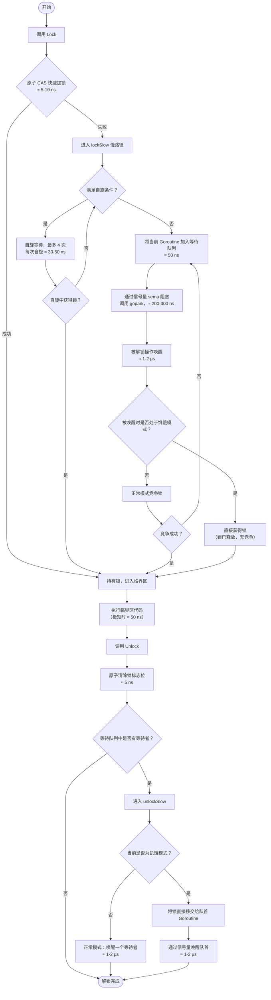

# Go 语言同步原语：深入理解 sync.Mutex

## 1. sync.Mutex 核心数据结构

`sync.Mutex` 仅占 8 字节，包含两个字段：

```go
type Mutex struct {
    state int32   // 锁状态（锁定、唤醒、饥饿模式、等待者计数）
    sema  uint32  // 信号量，用于阻塞和唤醒 Goroutine
}
```

`state` 字段的低 3 位分别表示：
- `mutexLocked`   (bit 0) : 锁是否已被持有
- `mutexWoken`    (bit 1) : 是否有被唤醒的 Goroutine
- `mutexStarving` (bit 2) : 是否处于饥饿模式
- 剩余高位：等待队列中的 Goroutine 数量

## 2. 加锁（Lock）与解锁（Unlock）完整流程（附执行时间）

下图展示了从尝试加锁到最终释放锁的全过程，**典型耗时**已标注（基于 2.5GHz CPU，数值为近似量级）。



## 3. 为什么 CAS 失败后不立即休眠，而是先自旋？

### 3.1 设计初衷

**避免昂贵的 Goroutine 调度开销**（约 **1-2 µs**）。

- **直接休眠**：每次加锁失败都挂起 Goroutine → 上下文切换 + 调度器开销 ≈ **1-2 µs** → 在**短临界区**（如仅修改一个 int，≈ 50 ns）场景下，调度开销是临界区执行时间的 **20-40 倍**。
- **先自旋**：在用户态循环检查锁状态（每次自旋 ≈ 30-50 ns），不放弃 CPU。若锁在自旋期间被释放（平均等待 ≈ 100-200 ns），则直接获得锁，避免了 µs 级的调度开销。

### 3.2 自旋的条件（极其严格）

进入自旋必须同时满足：
1. 多核处理器且 `GOMAXPROCS > 1`
2. 锁处于**正常模式**（饥饿模式下禁用自旋）
3. 自旋次数 < 4 次（总自旋时间 ≈ 4 × 40 ns = 160 ns）
4. 有空闲的 P（处理器）
5. 当前 P 的本地运行队列为空
6. 锁已被占用且未处于饥饿模式

### 3.3 为什么不自旋无限次？

- 避免在**长临界区**（> 1 µs）或**高竞争**时浪费 CPU。
- 有限次自旋（最多 4 次，总时间 < 200 ns）确保自旋只在**最有可能成功**的短暂时窗内使用。

## 4. 大量 Goroutine 争抢锁会导致 CPU 飙升吗？

**通常不会**。因为争抢失败的 Goroutine 会进入**阻塞状态**（`gopark`，耗时 ≈ 200-300 ns），不参与 CPU 运算。

### 4.1 可能引起 CPU 波动的场景

| 场景 | CPU 表现 | 典型耗时 |
|------|----------|----------|
| 短临界区 + 高竞争 | 短暂上升 | 自旋 4 次 ≈ 160 ns，随后阻塞 |
| 正常模式下的唤醒竞争 | 调度器活动增加 | 唤醒 ≈ 1-2 µs，竞争 CAS ≈ 10 ns |
| 饥饿模式 | 趋于平稳 | 唤醒 + 直接移交 ≈ 1-2 µs |
| 长临界区 | **较低** | 锁持有者持续占用 CPU，其余阻塞 |

### 4.2 真正导致 CPU 飙升的典型错误

- 在锁保护的临界区内执行**计算密集型任务**（循环、序列化等）→ 锁持有时间变长，其他 Goroutine 自旋或阻塞，但持有者占用 CPU 核心。
- 使用忙等待（如 `for { if tryLock() { break } }`）而不释放 CPU → 持续占用核心，无阻塞。

### 4.3 最佳实践

- 尽量**缩短临界区**，避免在锁内做耗时操作。
- 使用 `pprof` 的 `mutex` profile 分析锁竞争热点。
- 极高竞争场景考虑**分片（sharding）**、`sync.Map` 或**无锁结构**（`atomic`）。

## 5. 与 Java 互斥锁的对比（含典型耗时）

| 特性 | Go `sync.Mutex` | Java `synchronized` / `ReentrantLock` |
|------|----------------|----------------------------------------|
| 快速路径 | CAS（≈ 5-10 ns） | 偏向锁 / 轻量级锁 CAS（≈ 10-20 ns） |
| 自旋 | 有限次（最多 4 次，≈ 160 ns） | 适应性自旋（可长可短） |
| 阻塞 | 运行时信号量（用户态，≈ 200-300 ns 挂起） | 操作系统互斥量（可能进入内核态，≈ 1-10 µs） |
| 公平性 | 默认公平（饥饿模式） | 非公平（可配置公平锁） |
| 可重入 | ❌ 不可重入 | ✅ 可重入 |
| 锁升级 | 无 | 无锁 → 偏向锁 → 轻量级锁 → 重量级锁 |

## 6. 注意事项

- **不可重入**：同一 Goroutine 再次 `Lock` 会导致死锁。
- **复制锁**：`Mutex` 不能被值拷贝，应始终使用指针传递。
- **解锁前确保已加锁**：对未加锁的 Mutex 调用 `Unlock` 会 panic。
- **饥饿模式**：当等待时间超过 1ms 时自动进入，保证公平性。

## 7. 总结

`sync.Mutex` 通过**快速路径 CAS（≈ 5-10 ns） + 有限自旋（≈ 160 ns） + 信号量阻塞（≈ 200-300 ns） + 饥饿模式**的组合，在低竞争/短临界区时获得极高性能，在高竞争时保证公平性。理解其内部流程和设计权衡，有助于写出更高效的并发代码。