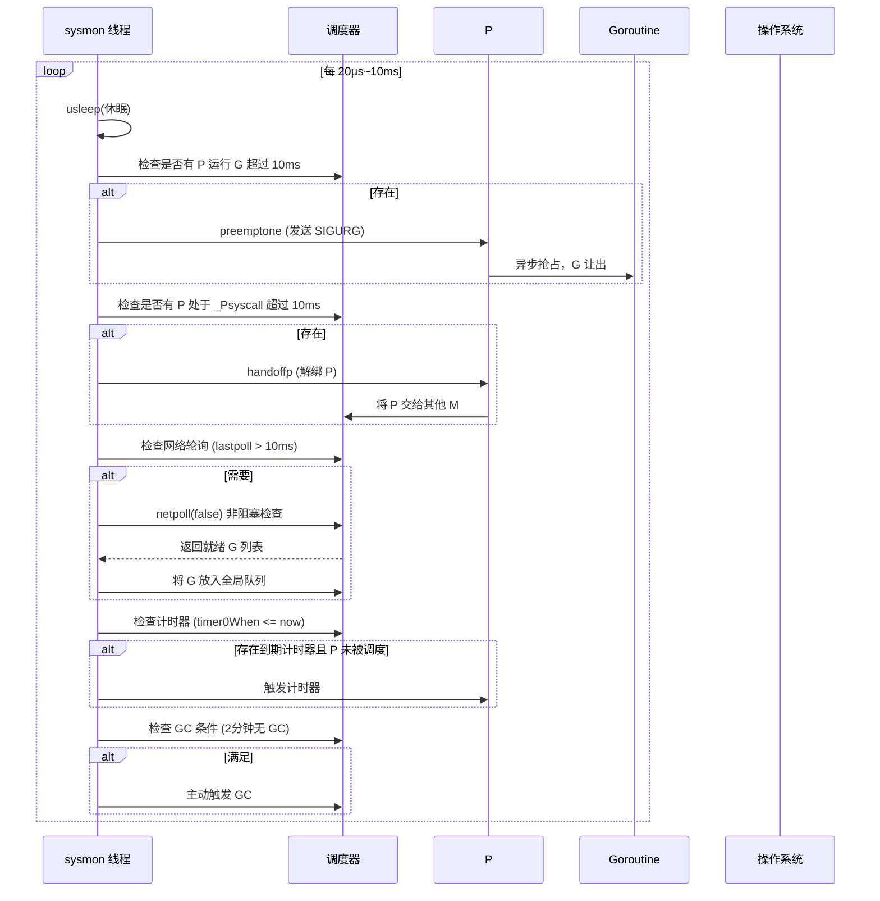

# Go 语言系统监控（Sysmon）实现原理、版本演进与使用指南

## 0. 为什么需要系统监控（Sysmon）？它主要解决什么问题？

系统监控（sysmon）是 Go 运行时中的一个**独立的后台监控线程**，它在程序启动后自动运行，无需用户显式创建。它的主要职责是**弥补调度器在特定场景下的不足**，确保程序在异常情况下仍能保持健康和高效。具体解决的问题包括：

1. **长时间阻塞的 Goroutine 抢占**：当 Goroutine 陷入死循环或长时间未让出 CPU 时，调度器无法强制抢占（Go 1.14 前依赖协作式抢占），sysmon 会检测并发送信号强制抢占，避免整个程序“卡死”。
2. **网络轮询器（netpoller）的定期触发**：当所有 P 都在执行长时间的系统调用或处于空闲状态时，调度器可能不会及时调用 `netpoll`，sysmon 会定期检查网络事件，唤醒就绪的 goroutine。
3. **计时器（timer）的精准触发**：如果某个 P 的本地计时器堆顶已到期但该 P 长时间未被调度，sysmon 可以强制触发该计时器。
4. **垃圾回收（GC）的触发**：当程序长时间没有触发 GC 且内存分配达到阈值时，sysmon 可以主动发起 GC。
5. **系统调用阻塞检测**：如果某个 M 长时间阻塞在系统调用中（超过 10ms），sysmon 会将其绑定的 P 解绑，让其他 M 使用该 P，提高并发度。

没有 sysmon，Go 程序在面对长时间运行或系统调用阻塞时，可能出现 goroutine 饥饿、GC 延迟、网络事件处理不及时等问题。sysmon 作为**最后一道防线**，保证了调度器的鲁棒性。

## 1. 新老版本设计区别

| 版本 | 关键变化 | 说明 |
|------|----------|------|
| **Go 1.0** | 引入 sysmon 基础功能 | 基本的抢占、网络轮询、GC 触发。 |
| **Go 1.5** | 改进抢占检测 | 减少误判，提高抢占及时性。 |
| **Go 1.8** | 增加系统调用阻塞检测 | 监控长时间系统调用，解绑 P。 |
| **Go 1.10** | 优化 sysmon 唤醒频率 | 减少不必要的唤醒，降低 CPU 消耗。 |
| **Go 1.14** | **基于信号的异步抢占** | sysmon 检测到长时间运行的 Goroutine 后，发送 SIGURG 信号强制抢占，彻底解决死循环问题。 |
| **Go 1.18+** | 调整 sysmon 的休眠策略 | 使 sysmon 在空闲时更节能。 |

## 2. 设计原理与数据结构

### 2.1 核心数据结构

sysmon 本身没有独立的复杂数据结构，它主要依赖于调度器中的全局变量和 P 的状态。关键信息包括：

- `sched.sysmonwait`：标记 sysmon 是否正在等待（避免重复唤醒）。
- `sched.lastpoll`：上次执行网络轮询的时间戳。
- 每个 P 的 `status`（如 `_Psyscall`）和 `timer0When`（最近计时器触发时间）。

### 2.2 执行机制（附典型耗时）

sysmon 是一个**永不阻塞的监控线程**，它会在一个无限循环中周期性执行，每次循环大致分为以下步骤：

1. **休眠**：默认休眠 20 µs（空闲时）到 10 ms（活跃时），通过 `usleep` 或 `nanosleep` 实现。
2. **抢占长时间运行的 G**：遍历所有 P，如果某个 P 正在运行 Goroutine 且超过 10 ms，则发出抢占信号（`preemptone`）。
3. **强制解绑系统调用阻塞的 P**：如果某个 P 的状态为 `_Psyscall` 且超过 10 ms，则调用 `handoffp` 将该 P 解绑，让其他 M 接管。
4. **检查网络轮询器**：如果距离上次网络轮询超过 10 ms，则调用 `netpoll(false)` 处理就绪的网络事件，并将就绪的 goroutine 放入全局运行队列。
5. **检查计时器**：遍历所有 P，如果发现某个 P 的 `timer0When` 已到期且该 P 未被调度，则主动触发计时器。
6. **触发 GC**：如果距离上次 GC 已经超过 2 分钟且内存分配超过阈值，则主动调用 `gcStart`。

**时序图（附时间）**：



**典型时间消耗**：
- sysmon 每次循环的休眠时间：20 µs ~ 10 ms（动态调整）
- 检查 P 状态：≈ 100 ns（遍历 P 数组）
- 发送抢占信号：≈ 1-2 µs
- 解绑 P：≈ 200-300 ns
- 网络轮询 `netpoll(false)`：≈ 1-10 µs（取决于就绪事件数）

## 3. 最佳实践案例（无直接代码，但可体现 sysmon 的作用）

Sysmon 对用户代码是透明的，但我们可以通过一些示例观察到它的影响：

### 3.1 死循环抢占（Go 1.14+）

```go
func main() {
    go func() {
        for {
            // 死循环，无函数调用
        }
    }()
    time.Sleep(5 * time.Second)
}
```
在 Go 1.14 之前，这个程序会永远卡住；Go 1.14+ 中，sysmon 会检测到该 Goroutine 运行超过 10ms，发送信号抢占，使调度器有机会运行其他 Goroutine。

### 3.2 长时间系统调用

```go
func main() {
    go func() {
        // 模拟一个长时间的系统调用（如阻塞读取）
        f, _ := os.Open("/dev/urandom")
        b := make([]byte, 1)
        f.Read(b) // 可能阻塞
    }()
    time.Sleep(100 * time.Millisecond)
    // 主 goroutine 仍可运行，因为 sysmon 会解绑 P
}
```

## 4. 注意事项

1. **sysmon 是独立线程，不绑定 P**：它由 `runtime` 启动，始终存在，不会受 goroutine 调度影响。
2. **抢占信号可能影响性能**：频繁的信号抢占会增加开销，应避免设计长时间运行的死循环。
3. **sysmon 不会无限制地频繁检查**：它会根据系统负载动态调整休眠时间（空闲时休眠更久，繁忙时休眠更短），避免过度消耗 CPU。
4. **不能依赖 sysmon 实现精确的定时任务**：sysmon 的检查周期是粗略的（毫秒级），不应依赖它来实现高精度计时。
5. **sysmon 触发的 GC 是“辅助性”的**：它只是在满足条件时发起 GC，不影响正常的 GC 触发策略（如内存阈值）。

## 5. 关联知识及如何关联

| 关联模块 | 关系 | 如何协同工作 |
|----------|------|--------------|
| **Goroutine 调度器** | sysmon 是调度器的监控组件，弥补调度器无法处理的边缘情况。 | 检测长时间运行的 G 并抢占；检测系统调用阻塞并解绑 P。 |
| **网络轮询器（netpoller）** | sysmon 定期触发 `netpoll(false)`，确保网络事件及时处理。 | 当调度器没有机会调用 `netpoll` 时（如所有 P 都在系统调用中），sysmon 作为后备。 |
| **计时器（Timer）** | sysmon 可以检测到到期但未被处理的计时器。 | 如果某个 P 的本地计时器堆顶已到期，但该 P 未被调度，sysmon 会强制触发该计时器。 |
| **垃圾回收（GC）** | sysmon 可以主动触发 GC。 | 当程序长时间没有 GC（如超过 2 分钟），sysmon 发起一次 GC，避免内存持续增长。 |
| **操作系统信号** | sysmon 通过发送 SIGURG 信号实现异步抢占。 | 检测到长时间运行的 G 后，`preemptone` 发送信号，信号处理函数中调用 `runtime.sigpreempt` 让 G 让出。 |

## 6. 系统监控生命周期（流程图，带时间）

```mermaid
graph TD
    Start([程序启动]) --> Init[创建 sysmon 线程<br>≈ 10 µs]
    Init --> Loop[进入无限循环]
    Loop --> Sleep[休眠 20µs ~ 10ms<br>（动态调整）]
    Sleep --> CheckPreempt[检查是否需要抢占 G]
    CheckPreempt --> HasLongG{存在运行>10ms 的 G？}
    HasLongG -- 是 --> SendSignal[发送 SIGURG 抢占信号<br>≈ 1-2 µs]
    SendSignal --> CheckSyscall
    HasLongG -- 否 --> CheckSyscall[检查系统调用阻塞 P]
    CheckSyscall --> HasLongSyscall{存在 _Psyscall >10ms 的 P？}
    HasLongSyscall -- 是 --> Handoff[解绑 P，交给其他 M<br>≈ 200-300 ns]
    HasLongSyscall -- 否 --> CheckNetpoll[检查网络轮询]
    Handoff --> CheckNetpoll
    CheckNetpoll --> NeedNetpoll{距离上次 netpoll >10ms？}
    NeedNetpoll -- 是 --> DoNetpoll[调用 netpoll(false)<br>≈ 1-10 µs]
    DoNetpoll --> InjectG[将就绪 G 放入全局队列]
    NeedNetpoll -- 否 --> CheckTimer[检查计时器]
    InjectG --> CheckTimer
    CheckTimer --> HasTimer{存在到期计时器<br>且对应 P 未调度？}
    HasTimer -- 是 --> FireTimer[触发计时器]
    HasTimer -- 否 --> CheckGC[检查 GC 条件]
    FireTimer --> CheckGC
    CheckGC --> NeedGC{距离上次 GC >2分钟？}
    NeedGC -- 是 --> StartGC[主动触发 GC<br>≈ 100 µs 以上]
    NeedGC -- 否 --> Loop
    StartGC --> Loop
```

**关键时间点**：
- 创建 sysmon 线程：≈ 10 µs
- 每次循环休眠：20 µs ~ 10 ms（动态）
- 抢占信号发送：≈ 1-2 µs
- 解绑 P：≈ 200-300 ns
- 网络轮询：≈ 1-10 µs
- 主动触发 GC：数百微秒到毫秒级

## 7. 常见问题 
### 7.1：sysmon 的动态调整公式

`sysmon` 线程并不是以固定频率工作的，它会根据系统负载动态调整自己的休眠时间，以实现效率与响应速度的平衡。

它的核心逻辑可以用下面的公式来理解：

```go
// 运行时 runtime/sysmon.go 中的核心逻辑
var delay uint32

for {
    if idle == 0 {
        delay = 20          // 忙碌时，初始休眠 20 微秒
    } else if idle > 50 {
        delay *= 2          // 空闲超过 50 轮，每次循环休眠时间翻倍
    }

    if delay > 10*1000 {    // 限制最长休眠时间
        delay = 10 * 1000   // 最大为 10 毫秒
    }

    usleep(delay)           // 执行休眠
}
```

以上逻辑可以总结为几点：

*   **工作模式**：`sysmon` 通过一个无限循环，持续执行监控任务。每次循环开始前，都会根据系统状态计算本次的休眠时间（`delay`）。
*   **调整规则**：
    *   **忙碌时**：如果系统一直处于活跃状态（例如，`sysmon` 每次循环都发现有任务需要处理），`sysmon` 会以非常高频的 `20μs` 作为休眠间隔来工作，以实现快速响应[reference:0]。
    *   **空闲时**：当系统连续 `50` 次循环都无事可做，`sysmon` 会让自己的休眠时间在每个循环后**翻倍**，逐步降低监控频率[reference:1]。
*   **上限控制**：为了避免空闲时完全停止工作，休眠时间不会无限增长。其上限被固定在 **10 毫秒（10ms）**。一旦程序趋于稳定，`sysmon` 的触发频率就会稳定在 `10ms`[reference:2][reference:3]。
*   **事件驱动重置**：`sysmon` 并非只靠轮询。一旦有网络事件发生，`netpoll` 会立即返回，`sysmon` 的休眠时间也会被**立即重置为 20μs**，从而迅速恢复到忙碌模式[reference:4]。

## 8. 总结

系统监控（sysmon）是 Go 运行时中一个至关重要的后台线程，它通过周期性检查和处理，解决了调度器在极端情况下的不足：抢占长时间运行的 Goroutine、解绑系统调用阻塞的 P、定期触发网络轮询和计时器、以及辅助 GC。它采用**动态休眠**机制，避免过度消耗 CPU。从 Go 1.14 开始，sysmon 支持基于信号的异步抢占，彻底解决了死循环导致程序无法响应的问题。理解 sysmon 的工作机制，有助于诊断性能瓶颈和调度延迟问题。

> 注：本文档基于 Go 1.18~1.22 源码分析，时间数据为典型量级，实际因系统负载而异。建议查看 `runtime/proc.go` 中的 `sysmon` 函数实现。