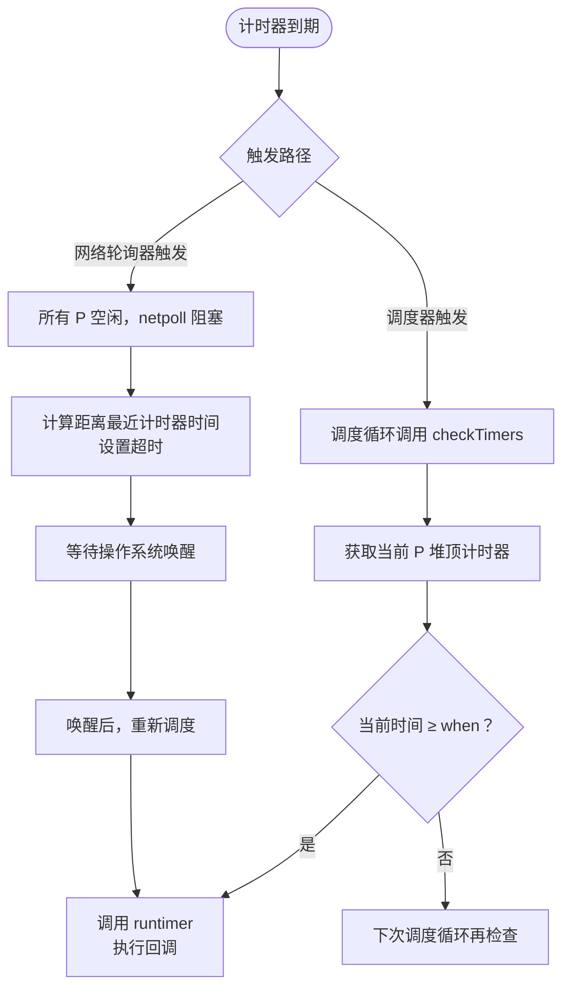
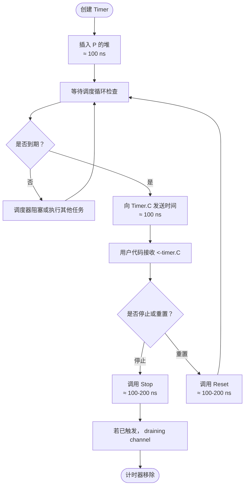

# Go 语言计时器（Timer）实现原理、版本演进与使用指南

## 0. 为什么需要计时器？它主要解决什么问题？

Go 语言中的计时器（`time.Timer` 和 `time.Ticker`）主要用于**在并发程序中执行延迟操作或周期性任务**，解决以下核心问题：

1. **延迟执行**：需要在未来某个时间点执行一个函数或发送一个事件（如超时控制、定时清理）。
2. **周期性任务**：需要按照固定间隔重复执行某个操作（如心跳检测、定期刷新缓存）。
3. **超时控制**：在网络请求、数据库操作或并发任务中，防止无限等待（结合 `select` 和 `context`）。
4. **调度器集成**：Go 运行时将计时器与网络轮询器、调度器协同工作，避免创建大量额外的 goroutine。

没有计时器，开发者只能通过手动循环检查时间或使用操作系统定时器 API，既不高效也不易用。`time.Timer` 提供了简洁的接口，底层由运行时统一管理，支持大规模并发定时任务。

## 1. 新老版本设计区别

| 版本 | 关键变化 | 说明 |
|------|----------|------|
| **Go 1.9 及之前** | 全局四叉堆（timers） | 所有 P 共享一个全局的计时器堆，使用互斥锁保护，高并发下锁竞争严重。 |
| **Go 1.10** | 引入 P 本地计时器 | 将计时器分配到各个 P 的本地堆中，减少锁竞争，性能大幅提升。 |
| **Go 1.14** | 计时器优化 + 网络轮询器协同 | 进一步减少锁开销，`time.Timer` 的 `Reset` 和 `Stop` 行为更准确，避免泄漏。 |
| **Go 1.17+** | 改进计时器唤醒机制 | 减少不必要的系统调用，提升空闲时的 CPU 利用率。 |

> 核心演进：从**全局锁 + 单堆**变为**每 P 独立的最小四叉堆（min‑heap）**，实现了 O(log n) 插入和删除，且大部分操作无锁竞争。

## 2. 设计原理与数据结构

### 2.1 核心数据结构

运行时计时器由 `runtime.timer` 结构体表示（位于 `runtime/time.go`）：

```go
type timer struct {
    pp *p               // 所属的 P
    when   int64        // 触发时间（纳秒）
    period int64        // 周期性间隔（0 表示非周期）
    f      func(interface{}, uintptr) // 回调函数
    arg    interface{}  // 回调参数
    seq    uintptr      // 回调附加参数（用于 netpoll）
    next   *timer       // 堆内链表（四叉堆内部使用）
    // ... 其他字段
}
```

每个 P 维护一个最小四叉堆（4‑ary heap），堆顶是最早到期的计时器。P 结构体中包含：

```go
type p struct {
    // ...
    timersLock mutex    // 保护 timers 的互斥锁
    timers []*timer     // 四叉堆（切片）
    numTimers uint32    // 计时器数量
    timer0When int64    // 堆顶计时器的触发时间（缓存）
    // ...
}
```

### 2.2 计时器状态机

运行时使用状态机的方式处理全部的计时器，其中包括 **10 种状态**和几种操作。由于 Go 语言的计时器需要同时支持增加、删除、修改和重置等操作，所以它的状态非常复杂，包含以下 10 种可能：

| 状态 | 解释 |
|------|------|
| `timerNoStatus` | 还没有设置状态 |
| `timerWaiting` | 等待触发 |
| `timerRunning` | 运行计时器函数 |
| `timerDeleted` | 被删除 |
| `timerRemoving` | 正在被删除 |
| `timerRemoved` | 已经被停止并从堆中删除 |
| `timerModifying` | 正在被修改 |
| `timerModifiedEarlier` | 被修改到了更早的时间 |
| `timerModifiedLater` | 被修改到了更晚的时间 |
| `timerMoving` | 已经被修改正在被移动 |

**状态关键信息**：
- `timerRunning`、`timerRemoving`、`timerModifying` 和 `timerMoving` 停留的时间都比较短；
- `timerWaiting`、`timerRunning`、`timerDeleted`、`timerRemoving`、`timerModifying`、`timerModifiedEarlier`、`timerModifiedLater` 和 `timerMoving` 表示计时器在处理器的堆上；
- `timerNoStatus` 和 `timerRemoved` 表示计时器不在堆上；
- `timerModifiedEarlier` 和 `timerModifiedLater` 表示计时器虽然在堆上，但是可能位于错误的位置上，需要重新排序。

状态机中包含如下 **7 种不同操作**：
- `runtime.addtimer` — 向当前处理器增加新的计时器
- `runtime.deltimer` — 将计时器标记成 `timerDeleted` 删除处理器中的计时器
- `runtime.modtimer` — 网络轮询器会调用该函数修改计时器
- `runtime.cleantimers` — 清除队列头中的计时器，能够提升程序创建和删除计时器的性能
- `runtime.adjusttimers` — 调整处理器持有的计时器堆，包括移动会稍后触发的计时器、删除标记为 `timerDeleted` 的计时器
- `runtime.runtimer` — 检查队列头中的计时器，在其准备就绪时运行该计时器

### 2.3 计时器触发流程

计时器都交由处理器的**网络轮询器**和**调度器**触发。主要存在两种触发路径：

#### 路径一：调度器主动触发（`runtime.checkTimers`）

调度器在每个调度循环中调用 `checkTimers`，该函数会检查当前 P 的堆顶计时器是否到期，若到期则执行 `runtimer`。

#### 路径二：网络轮询器协同触发

当所有 P 都空闲且没有可运行的 G 时，`netpoll` 会阻塞等待。阻塞前会计算距离最近计时器到期的时间，设置超时，到期后由操作系统唤醒，再触发计时器。

**两种触发过程流程图**：



### 2.4 清理计时器的两种粒度

#### `runtime.cleantimers` —— 仅清理堆顶

`cleantimers` **只操作堆顶的计时器**，不会遍历整个堆。它检查堆顶计时器的状态：
- 若为 `timerDeleted`，则将其从堆中移除（弹出），并继续检查新的堆顶。
- 若为 `timerModifiedEarlier` 或 `timerModifiedLater`，则将其重新调整（修正位置），然后停止。
- 若堆顶状态正常（`timerWaiting`），则直接返回。

该函数的主要作用是快速清理堆顶的“垃圾”，避免在每次调度检查时被过期状态阻塞。

#### `runtime.clearDeletedTimers` —— 清理全堆已删除计时器

当 `checkTimers` 发现**当前 P 堆中处于 `timerDeleted` 状态的计时器数量超过堆中计时器总数的 1/4** 时，会调用 `clearDeletedTimers` 遍历整个堆，**一次性删除所有标记为 `timerDeleted` 的计时器**，并重新整理堆结构。这保证了堆中无效条目不会无限累积，维持堆操作效率。

**触发条件**：`runtime.checkTimers` 的最后，如果当前 Goroutine 的处理器和传入的处理器相同，且处理器中删除状态的计时器是堆中计时器的 1/4 以上，就会调用 `runtime.clearDeletedTimers`。

## 3. 执行机制流程图（附典型耗时）

```mermaid
graph TD
    Start([调用 NewTimer/After]) --> Alloc[分配 timer 结构<br>≈ 50 ns]
    Alloc --> AddTimer[调用 addtimer<br>插入当前 P 的堆]
    AddTimer --> SiftUp[堆上浮调整<br>O(log n) ≈ 100-200 ns]
    SiftUp --> Check{堆顶是否变化？}
    Check -- 是 --> Wake[如果 P 空闲，唤醒 M<br>≈ 1 µs]
    Check -- 否 --> Wait[等待调度循环检查]
    Wait --> Sched[调度器调用 checkTimers]
    Sched --> GetTop[获取堆顶触发时间<br>≈ 10 ns]
    GetTop --> Expired{当前时间 ≥ when？}
    Expired -- 否 --> Sleep[计算剩余睡眠时间<br>调用 netpoll 阻塞]
    Sleep --> Wait
    Expired -- 是 --> CallBack[执行回调函数 f<br>（用户代码）]
    CallBack --> HasPeriod{period > 0？}
    HasPeriod -- 是 --> ResetTimer[重置 when += period<br>堆调整 ≈ 100-200 ns]
    HasPeriod -- 否 --> Remove[从堆中删除<br>≈ 100-200 ns]
    ResetTimer --> Wait
    Remove --> End([计时器停止])
```

**典型时间消耗**：
- 创建 Timer：≈ 50-100 ns（不含用户回调）
- 堆插入/删除：≈ 100-200 ns（n 较小时）
- 检查到期：≈ 10 ns
- 唤醒空闲线程：≈ 1-2 µs
- 回调执行：取决于用户代码

## 4. 最佳实践案例（含代码）

### 4.1 超时控制（select + Timer）

```go
func queryWithTimeout(db *sql.DB) error {
    ctx, cancel := context.WithTimeout(context.Background(), 1*time.Second)
    defer cancel()
    // 使用 context 的 timer，不需要手动创建 Timer
    return db.QueryContext(ctx, "SELECT ...")
}

// 或手动使用 Timer
func doWithTimeout() {
    timer := time.NewTimer(2 * time.Second)
    select {
    case <-timer.C:
        fmt.Println("timeout")
    case result := <-someCh:
        fmt.Println("result:", result)
        if !timer.Stop() {
            <-timer.C // 避免泄漏
        }
    }
}
```

### 4.2 周期性任务（Ticker）

```go
func heartbeat() {
    ticker := time.NewTicker(5 * time.Second)
    defer ticker.Stop()
    for range ticker.C {
        fmt.Println("heartbeat")
    }
}
```

### 4.3 延迟执行（AfterFunc）

```go
time.AfterFunc(10*time.Second, func() {
    fmt.Println("10 seconds later")
})
```

### 4.4 重置计时器（Reset）

```go
func adaptiveTimer(duration time.Duration) {
    timer := time.NewTimer(duration)
    for {
        select {
        case <-timer.C:
            fmt.Println("timeout, extend duration")
            timer.Reset(2 * duration) // 重置
        }
    }
}
```

## 5. 注意事项

### 5.1 Timer 停止后需要 draining channel

- 调用 `timer.Stop()` 后，如果计时器已经触发但尚未被接收，`timer.C` 中仍会有一个过期值。正确模式：
  ```go
  if !timer.Stop() {
      <-timer.C
  }
  ```

### 5.2 Reset 的相同问题

- 重置一个已经触发的 Timer 时，同样需要先 draining channel：
  ```go
  if !timer.Stop() {
      <-timer.C
  }
  timer.Reset(newDuration)
  ```

### 5.3 Ticker 必须显式停止

- `time.Ticker` 不会自动停止，不调用 `Stop` 会导致 goroutine 泄漏（后台持续发送）。
- 使用 `defer ticker.Stop()` 确保释放资源。

### 5.4 After 和 Tick 的陷阱

- `time.After` 在超时前不会被 GC 回收，大量使用可能导致内存增长。适用于一次性超时，循环中应使用 `NewTimer` + `Reset`。
- `time.Tick` 同样会永久泄漏，除非程序退出；应使用 `NewTicker` 并手动停止。

### 5.5 计时器精度

- 计时器依赖操作系统的时钟中断和调度器，实际触发时间可能有几毫秒的误差（尤其在系统负载高时）。

### 5.6 不要依赖计时器的绝对精确性

- 调度器可能延迟处理计时器，尤其是当系统处于 GC 或高竞争状态时。不应假设计时器会在微秒级精确触发。

## 6. 关联知识

| 关联模块 | 关系 |
|----------|------|
| **Goroutine 调度器** | `checkTimers` 在调度循环中调用，计时器到期会唤醒 P。 |
| **网络轮询器 (netpoll)** | 空闲时根据最近计时器的剩余时间阻塞，实现准确定时唤醒。 |
| **Channel** | `Timer.C` 是一个 channel，计时器到期时向该 channel 发送当前时间。 |
| **Context** | `context.WithTimeout` 和 `context.WithDeadline` 底层使用 `time.Timer` 实现取消。 |
| **Select** | 常与 Timer 结合实现超时或周期性操作。 |

## 7. 计时器生命周期（带时间）



**关键时间点**：
- 创建到插入：≈ 100 ns
- 到期触发：≈ 100 ns（发送 channel）
- 停止/重置：≈ 100-200 ns
- 调度器唤醒开销：≈ 1-2 µs（如果 P 空闲）

## 8. 总结

Go 计时器（Timer/Ticker）通过每个 P 独立的最小四叉堆实现高效的定时任务管理，解决了并发环境下的延迟执行、周期性任务和超时控制问题。Go 1.10 后引入的 P 本地计时器极大减少了锁竞争，性能优异。计时器状态机支持复杂的删除、修改操作，`cleantimers` 仅清理堆顶，而 `clearDeletedTimers` 在删除比例过高时全堆清理。使用时务必注意停止后的 draining 操作和 Ticker 的显式关闭，避免资源泄漏。计时器与调度器、网络轮询器、Channel 和 Context 紧密协同，是构建可靠并发程序的基石。

> 注：本文档基于 Go 1.18~1.22 源码分析，时间数据为典型量级，实际因 CPU、负载而异。建议查看 `runtime/time.go` 和 `time/sleep.go`。