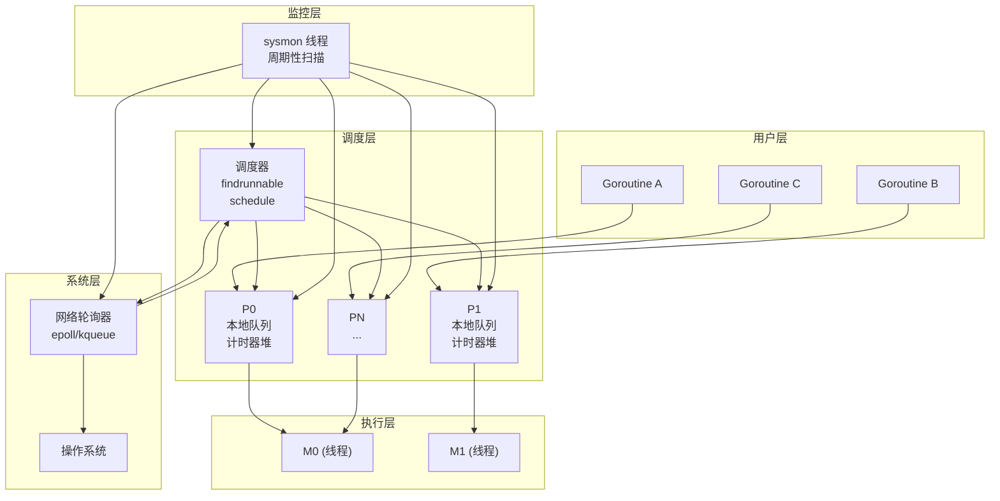
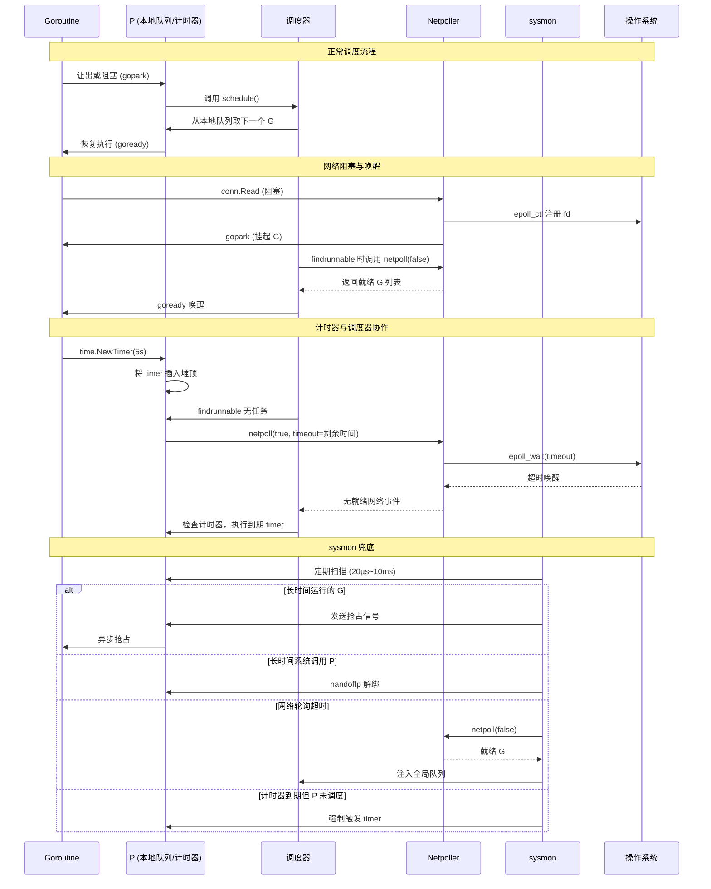
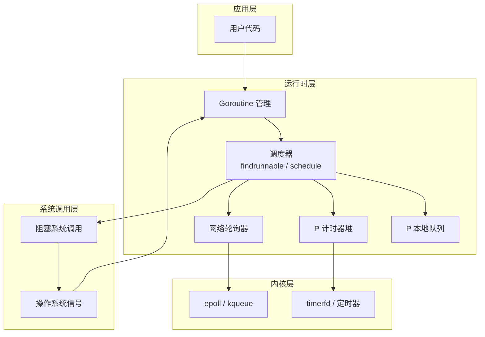

## G、M、P、Timer、Netpoller、sysmon 和 Scheduler 的关联关系总结

### 1. 核心概念回顾

| 组件 | 说明 |
|------|------|
| **G (Goroutine)** | 用户态轻量级线程，执行用户代码，拥有自己的栈。 |
| **M (Machine)** | 操作系统线程，执行 G 的代码，必须绑定一个 P 才能运行。 |
| **P (Processor)** | 逻辑处理器，持有本地运行队列和计时器堆，负责调度 G 到 M 上执行。 |
| **Scheduler** | 调度器，负责 G 的运行、阻塞、唤醒、负载均衡（工作窃取）。 |
| **Netpoller** | 网络轮询器，基于 epoll/kqueue 实现，管理网络文件描述符的就绪事件。 |
| **Timer** | 计时器，每个 P 维护一个最小四叉堆，用于延迟执行和周期性任务。 |
| **sysmon** | 系统监控线程，独立于 GMP，周期性扫描，处理抢占、阻塞检测、GC 触发等。 |

### 2. 关联关系图（架构总览）

### 3. 交互图（组件之间的协作流程）

### 4. 组件依赖关系矩阵

| 组件 | 依赖/关联 | 说明 |
|------|-----------|------|
| **Scheduler** | P, G, M, Netpoller, Timer | 调度器直接管理 P 的运行队列和计时器堆，调用 netpoll 获取就绪 G。 |
| **P** | G, Timer, M | P 持有本地 G 队列和计时器堆，必须绑定 M 才能执行。 |
| **M** | P | M 必须关联一个 P 才能运行 G。 |
| **G** | P, M | G 被调度到 P 的队列中，最终在 M 上执行。 |
| **Netpoller** | OS, Scheduler | netpoll 依赖操作系统事件机制，调度器通过它获取就绪网络 G。 |
| **Timer** | P, Scheduler, sysmon | Timer 存储在 P 的堆中，调度器在阻塞等待时使用其到期时间作为 netpoll 超时，sysmon 兜底触发。 |
| **sysmon** | P, Netpoller, Scheduler | sysmon 独立运行，定期扫描并干预异常情况。 |

### 5. 关键机制说明

#### 5.1 调度器与 netpoller 的协作
- 调度器在 `findrunnable` 中无任务时，会调用 `netpoll(true, timeout)`，其中 `timeout` 取当前 P 的计时器堆顶剩余时间。
- 这实现了 **一次系统调用同时等待网络事件和计时器**，避免了轮询。

#### 5.2 计时器的精准触发
- 每个 P 维护一个最小堆，堆顶为最近到期计时器。
- 计时器由网络轮询器管理和触发，它能够让网络轮询器立刻返回并让运行时检查是否有需要触发的计时器。
- 调度器阻塞时使用该到期时间作为 `epoll_wait` 的超时参数。
- 到期后，`epoll_wait` 返回，调度器检查并执行计时器回调。

#### 5.3 sysmon 的兜底角色
- **抢占**：检测到 G 运行超过 10ms 且无抢占点 → 发送 SIGURG 信号强制抢占。
- **系统调用解绑**：P 处于 `_Psyscall` 超过 10ms → 解绑 P，让其他 M 使用。
- **网络事件**：距离上次 `netpoll` 超过 10ms → 主动调用 `netpoll(false)` 获取就绪 G。
- **计时器**：如果某个 P 的堆顶计时器已到期但该 P 未被调度（如 P 处于空闲或系统调用），sysmon 会直接触发该计时器。

### 6. 架构图（分层视角）

### 7. 总结

- **调度器**是核心，**事件驱动**，空闲时通过 `netpoll` 阻塞等待网络事件或计时器到期，**不主动轮询**。
- **netpoller** 封装了操作系统事件机制，为调度器提供就绪网络 G，同时接受超时参数以支持计时器等待。
- **计时器**附着在 P 上，调度器阻塞时将其到期时间作为超时，实现了 **计时器与网络事件的统一等待**。
- **sysmon** 是**主动轮询**的监控线程，处理调度器无法覆盖的边缘情况（死循环、长时间系统调用、计时器遗漏等），保证系统健壮性。

这种设计使得 Go 在大多数情况下零开销（调度器阻塞时不消耗 CPU），同时通过 sysmon 兜底，兼顾了高性能和高可靠性。